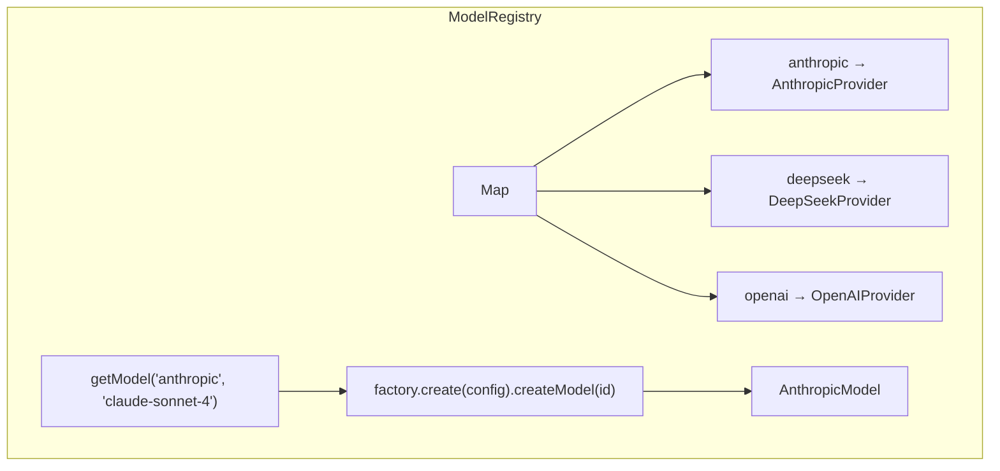

# 模型注册中心

## 1. 本节目标

理解 `ModelRegistry` 的设计，以及工厂模式与注册表模式如何配合使用。

## 2. 前置知识

- 了解工厂模式（Factory Pattern）
- 了解注册表模式（Registry Pattern）
- 熟悉 TypeScript 的 `Map` 类型

## 3. 核心概念

### 3.1 注册表模式

注册表是一个全局可访问的"目录"，用来存储和管理对象。在 AI 层中，`ModelRegistry` 是一个注册表，管理所有已注册的 LLM 提供商工厂。

### 3.2 工厂模式 + 注册表 = 灵活的管理

两个模式配合使用，各司其职：

- **工厂模式（ProviderFactory）** — 负责创建具体的 Model 实例，封装了创建逻辑
- **注册表模式（ModelRegistry）** — 负责管理哪些工厂可用，提供查询和获取接口



## 4. 代码实现

### 4.1 完整代码

```typescript
import type { ProviderFactory, Model, ModelInfo } from './types.js'

export class ModelRegistry {
  /** 存储所有已注册的提供商工厂 */
  private providers = new Map<string, ProviderFactory>()

  /** 注册一个提供商
   * @param name - 提供商名称，如 "anthropic"
   * @param factory - 提供商工厂实例
   */
  setProvider(name: string, factory: ProviderFactory): void {
    // 将工厂实例存入 Map
    this.providers.set(name, factory)
  }

  /** 获取一个模型实例
   * @param provider - 提供商名称
   * @param modelId - 模型 ID
   * @param config - 提供商配置（如 apiKey）
   * @returns Model 实例，如果提供商或模型不存在则返回 null
   */
  getModel(
    provider: string,
    modelId: string,
    config?: { apiKey?: string; baseUrl?: string },
  ): Model | null {
    // 1. 查找提供商工厂
    const factory = this.providers.get(provider)
    if (!factory) return null

    // 2. 创建提供商实例（传入配置）
    const instance = factory.create({
      apiKey: config?.apiKey || '',
      baseUrl: config?.baseUrl,
    })

    // 3. 创建具体的模型实例
    return instance.createModel(modelId)
  }

  /** 列出所有已注册的模型
   * @param provider - 可选，只列出指定提供商的模型
   */
  listModels(provider?: string): ModelInfo[] {
    if (provider) {
      // 只列出指定提供商的模型
      const factory = this.providers.get(provider)
      if (!factory) return []
      const instance = factory.create({ apiKey: '' })
      return instance.listModels()
    }

    // 列出所有提供商的模型
    const allModels: ModelInfo[] = []
    for (const [, factory] of this.providers) {
      const instance = factory.create({ apiKey: '' })
      allModels.push(...instance.listModels())
    }
    return allModels
  }
}
```

### 4.2 使用方式

```typescript
import { ModelRegistry } from './ai/registry.js'
import { AnthropicProvider } from './ai/providers/anthropic.js'
import { DeepSeekProvider } from './ai/providers/deepseek.js'
import { OpenAIProvider } from './ai/providers/openai.js'

// 1. 创建注册表
const registry = new ModelRegistry()

// 2. 注册提供商
registry.setProvider('anthropic', AnthropicProvider)
registry.setProvider('deepseek', DeepSeekProvider)
registry.setProvider('openai', OpenAIProvider)

// 3. 获取模型实例
const model = registry.getModel('anthropic', 'claude-sonnet-4-20250514', {
  apiKey: process.env.ANTHROPIC_API_KEY,
})

if (model) {
  // 4. 使用模型
  for await (const event of model.stream({
    systemPrompt: '你是一个助手',
    messages: [{ role: 'user', content: '你好' }],
  })) {
    // ...
  }
} else {
  console.error('模型不存在')
}

// 5. 列出所有可用模型
const allModels = registry.listModels()
console.log(allModels)
// 输出:
// [
//   { id: 'claude-sonnet-4-20250514', provider: 'anthropic', ... },
//   { id: 'deepseek-chat', provider: 'deepseek', ... },
//   { id: 'gpt-4o', provider: 'openai', ... },
//   ...
// ]
```

### 4.3 设计要点

**为什么 `getModel()` 每次调用都创建新的实例？**

```typescript
getModel(provider: string, modelId: string, config?: { ... }): Model | null {
  const factory = this.providers.get(provider)
  if (!factory) return null

  // 每次调用都创建新的实例
  const instance = factory.create({ ... })
  return instance.createModel(modelId)
}
```

这样做的好处：

1. **线程安全** — 每次调用都是独立的实例，不会相互影响
2. **配置灵活** — 每次调用可以传入不同的 `config`（如不同的 apiKey）
3. **无状态** — Model 实例本身不保存状态，创建成本低

**为什么 `listModels()` 需要传 `apiKey`？**

```typescript
const instance = factory.create({ apiKey: '' })
```

`listModels()` 只关心模型列表，不需要真正的 API Key。传空字符串是因为 `ProviderFactory.create()` 接口要求 `apiKey` 字段，但 `listModels()` 的实现并不使用它。这是一个设计上的小瑕疵，但简化了接口。

## 5. 运行与验证

```bash
# 查看 registry.ts 的代码
cat src/ai/registry.ts

# 检查类型正确性
npx tsc --noEmit src/ai/registry.ts

# 测试注册表的基本功能
cat << 'EOF' > /tmp/test-registry.ts
import { ModelRegistry } from './src/ai/registry.js'
import { AnthropicProvider } from './src/ai/providers/anthropic.js'

const registry = new ModelRegistry()
registry.setProvider('anthropic', AnthropicProvider)

console.log('Models:', registry.listModels('anthropic'))
console.log('Model:', registry.getModel('anthropic', 'claude-sonnet-4-20250514', { apiKey: 'test' }))
console.log('Unknown provider:', registry.getModel('unknown', 'model', {}))
EOF
```

## 6. 小结

`ModelRegistry` 通过工厂模式与注册表模式的结合，提供了一个灵活且可扩展的模型管理机制。注册表负责管理提供商工厂的注册和查询，工厂负责创建具体的模型实例，两者职责分离，各司其职。

### 思考题

1. 如果希望 `getModel()` 缓存已创建的 Model 实例（相同 provider + modelId 复用），应该如何修改代码？
2. 现有设计中，`listModels()` 每次调用都创建临时实例，如果这个操作频繁调用，有什么优化方案？
3. `setProvider('anthropic', AnthropicProvider)` 的第二个参数是一个带有 `create()` 方法的对象字面量，如果在注册后修改了这个对象，会发生什么？

> ← [上一节](./03-provider-pattern.md) · [下一节](./05-error-handling.md) →
>
> [📚 返回章节首页](../02-ai-layer/README.md)