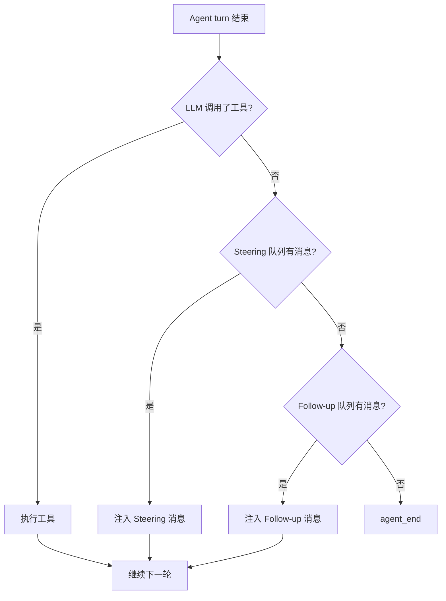

# 消息队列

> 消息队列是 Agent 的"异步消息缓冲区"，让用户可以在 Agent 运行中插入指令或追加任务。

## 1. 本节目标

- 理解 Steering 队列和 Follow-up 队列的区别
- 掌握双队列的决策逻辑
- 了解消息队列与 Agent Loop 的集成方式

## 2. 前置知识

- 理解 Agent Loop 的核心循环（见 [01-agent-loop.md](01-agent-loop.md)）
- 了解 AgentMessage 类型
- 了解队列（Queue）数据结构的基本概念

## 3. 核心概念

### 3.1 类比：餐厅的加单机制

想象你在餐厅吃饭：

| 队列概念 | 餐厅类比 | 说明 |
|---------|---------|------|
| Steering 队列 | 正在用餐时喊"服务员加个辣椒" | 高优先级，当前任务还没完成就想插入指令 |
| Follow-up 队列 | 吃完后说"再帮我打包一份" | 低优先级，当前任务完成后追加任务 |
| `next()` 方法 | 服务员查看先处理哪个请求 | 按优先级取消息 |

### 3.2 决策逻辑流程



**优先级规则：`Steering > Follow-up > 结束`**

## 4. 代码实现

### 4.1 MessageQueue 类

```typescript
// src/agent/queue.ts 第 18-78 行
export class MessageQueue {
  /** 高优先级：运行中插入的指令 */
  private steering: AgentMessage[] = []
  /** 低优先级：追加的任务 */
  private followUpQueue: AgentMessage[] = []

  // ── 入队方法 ──

  /** 向 Steering 队列添加消息（运行中插入） */
  steer(message: string): void {
    this.steering.push({
      id: `steer-${Date.now()}-${this.steering.length}`,
      parentId: null,
      role: 'user',
      content: message,
      createdAt: Date.now(),
    })
  }

  /** 向 Follow-up 队列添加消息（任务完成后追加） */
  followUp(message: string): void {
    this.followUpQueue.push({
      id: `follow-${Date.now()}-${this.followUpQueue.length}`,
      parentId: null,
      role: 'user',
      content: message,
      createdAt: Date.now(),
    })
  }

  // ── 出队方法 ──

  /** 获取下一条要处理的消息（按优先级） */
  next(): AgentMessage | null {
    // Steering 优先
    if (this.steering.length > 0) {
      return this.steering.shift()!
    }
    // Follow-up 其次
    if (this.followUpQueue.length > 0) {
      return this.followUpQueue.shift()!
    }
    return null
  }

  // ── 查询方法 ──

  /** 检查是否有待处理的消息 */
  hasPending(): boolean {
    return this.steering.length > 0 || this.followUpQueue.length > 0
  }

  // ── 清空方法 ──

  clearSteering(): void { this.steering = [] }
  clearFollowUp(): void { this.followUpQueue = [] }
  clearAll(): void {
    this.steering = []
    this.followUpQueue = []
  }
}
```

### 4.2 与 Agent Loop 的集成

在 `loop.ts` 中，消息队列在 `runLoop()` 的"无工具调用"分支中被使用：

```typescript
// src/agent/loop.ts 第 206-223 行
// 当 LLM 没有调用工具时...
if (toolCalls.length === 0) {
  await this.emit({
    type: 'turn_end',
    message: assistantMessage,
    toolResults: [],
  })

  // 从队列中取出下一条消息
  const nextMsg = this.queue.next()
  if (nextMsg) {
    this.state.messages.push(nextMsg)
    continue  // 有队列消息 → 继续下一轮
  }

  break  // 队列为空 → 结束
}
```

**关键点：**
- 队列只在 LLM **没有调用工具**时检查
- 如果 LLM 调用了工具，先执行工具，把结果送回 LLM，让 LLM 继续处理
- 队列消息直接作为 `user` 角色注入消息历史
- 注入后继续循环，LLM 会看到这条新消息并作出响应

### 4.3 Agent 对外的队列接口

```typescript
// src/agent/loop.ts 第 477-496 行
/** 运行中插入指令（高优先级） */
steer(message: string): void {
  this.queue.steer(message)
}

/** 追加后续任务（低优先级） */
followUp(message: string): void {
  this.queue.followUp(message)
}

clearSteeringQueue(): void {
  this.queue.clearSteering()
}

clearFollowUpQueue(): void {
  this.queue.clearFollowUp()
}

clearAllQueues(): void {
  this.queue.clearAll()
}
```

## 5. 运行与验证

### 5.1 基本使用

```typescript
import { MessageQueue } from './src/agent/queue.js'

const queue = new MessageQueue()

// 添加消息
queue.steer('停下！先解释一下你在做什么')
queue.followUp('然后帮我检查一下代码')

// 按优先级取消息
console.log(queue.next()?.content)  // "停下！先解释一下你在做什么"
console.log(queue.next()?.content)  // "然后帮我检查一下代码"
console.log(queue.next())           // null
```

### 5.2 优先级测试

```typescript
const queue = new MessageQueue()

queue.followUp('低优先级任务 A')
queue.steer('高优先级指令 B')
queue.followUp('低优先级任务 C')

// 即使 follow-up 先入队，steering 也会优先被处理
console.log(queue.next()?.content)  // "高优先级指令 B"
console.log(queue.next()?.content)  // "低优先级任务 A"
console.log(queue.next()?.content)  // "低优先级任务 C"
```

### 5.3 在 Agent 中使用

```typescript
const agent = new Agent({ ... })

// 异步启动 Agent
agent.prompt('帮我写一个 Node.js 的 HTTP 服务器')

// 在 Agent 运行中插入指令
setTimeout(() => {
  agent.steer('记得添加错误处理中间件')
}, 1000)

// 等待完成
await agent.waitForIdle()
```

## 6. 小结

### 学到的核心概念

1. **双队列设计**：Steering 高优先级（运行中插入），Follow-up 低优先级（追加任务）
2. **决策逻辑**：Steering > Follow-up > 结束
3. **集成方式**：在 `runLoop()` 的"无工具调用"分支中检查队列
4. **队列消息**以 `user` 角色注入消息历史，LLM 自然能理解

### 思考题

1. 如果用户在 Steering 队列中连续插入了多条消息，这些消息是按什么顺序处理的？（先进先出还是后进先出？）
2. 当前的实现中，队列只在 LLM 没有调用工具时检查。假设 LLM 连续调用了 5 轮工具，这期间插入的 Steering 消息要等到第 5 轮结束后才能被处理。这是否合理？如果要让 Steering 消息能"打断"正在执行的工具，应该怎么改？
3. `MessageQueue` 中的消息 ID 使用了 `steer-` 和 `follow-` 前缀。如果与 `generateId()` 生成的 `msg-` 前缀消息混合使用，在日志中会不会造成混淆？
4. `hasPending()` 方法目前没有被 Agent 使用。如果要新增一个"在 Agent 空闲时检查队列"的功能，应该怎么设计？

> ← [上一节](./02-state-management.md) · [下一节](./04-permission-system.md) →
>
> [📚 返回章节首页](../03-agent-layer/README.md)