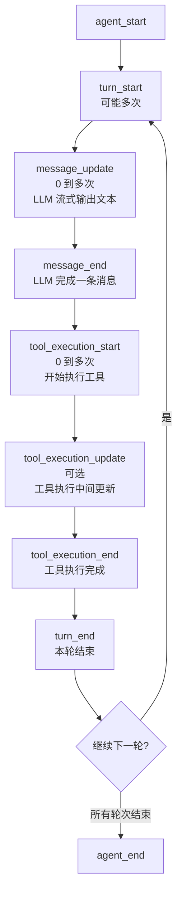

# 事件驱动模式

> Agent 的事件系统是整个 Agent 的"广播电台"，让外部可以实时了解 Agent 内部发生了什么。

## 1. 本节目标

- 理解 AgentEvent 联合类型的所有事件
- 掌握 subscribe/emit 模式的设计与实现
- 了解事件流的完整生命周期
- 理解同一 Agent 实例如何对接多种输出模式

## 2. 前置知识

- 理解 Agent Loop 的完整流程（见 [01-agent-loop.md](01-agent-loop.md)）
- 了解 TypeScript 的联合类型（Union Type）
- 了解发布-订阅模式（Pub/Sub）

## 3. 核心概念

### 3.1 类比：体育赛事的实况转播

事件系统就像体育赛事的实况转播：

| 事件概念 | 体育转播类比 | 说明 |
|---------|-------------|------|
| `agent_start` | 比赛开始哨声 | Agent 开始处理请求 |
| `turn_start` | 一局开始 | Agent 的一轮思考循环开始 |
| `message_update` | 实时比分更新 | LLM 正在生成文本的实时片段 |
| `message_end` | 一局结束 | LLM 生成了一条完整消息 |
| `tool_execution_start` | 运动员开始动作 | 开始执行工具 |
| `tool_execution_end` | 动作完成 | 工具执行完成 |
| `agent_end` | 比赛结束 | Agent 完成所有处理 |
| `subscribe` | 观众买票入场 | 订阅事件 |
| `emit` | 广播信号 | 向所有订阅者发送事件 |

### 3.2 事件流生命周期



## 4. 代码实现

### 4.1 AgentEvent 联合类型

```typescript
// src/ai/types.ts 第 161-173 行
export type AgentEvent =
  // Agent 生命周期
  | { type: 'agent_start' }                                          // Agent 开始处理
  | { type: 'agent_end'; messages: AgentMessage[] }                  // Agent 完成处理

  // Turn 生命周期
  | { type: 'turn_start' }                                           // 一轮循环开始
  | { type: 'turn_end'; message: AgentMessage; toolResults: ToolResult[] }  // 一轮循环结束

  // 消息事件
  | { type: 'message_start'; message: AgentMessage }                 // 消息开始生成
  | { type: 'message_update'; message: Partial<AgentMessage> }       // 消息内容更新（流式）
  | { type: 'message_end'; message: AgentMessage }                   // 消息完成

  // 工具执行事件
  | { type: 'tool_execution_start'; toolCallId: string; toolName: string; args: unknown }    // 工具开始执行
  | { type: 'tool_execution_update'; toolCallId: string; partialResult: ToolUpdate }         // 工具中间更新
  | { type: 'tool_execution_end'; toolCallId: string; result: ToolResult }                   // 工具执行完成

  // 错误事件
  | { type: 'error'; message: string }                                                       // 错误发生
```

**事件分类：**

| 类别 | 事件 | 触发时机 | 触发位置 |
|------|------|---------|---------|
| 生命周期 | `agent_start` | `prompt()` 开始时 | `loop.ts` 第 151 行 |
| 生命周期 | `agent_end` | `prompt()` 结束时 | `loop.ts` 第 153 行 |
| Turn | `turn_start` | 每轮循环开始时 | `loop.ts` 第 168 行 |
| Turn | `turn_end` | 每轮循环结束时 | `loop.ts` 第 228 行 |
| 消息 | `message_update` | LLM 流式输出文本时 | `loop.ts` 第 280 行 |
| 消息 | `message_end` | 一条消息完成时 | `loop.ts` 第 203 行 |
| 工具 | `tool_execution_start` | 工具开始执行时 | `loop.ts` 第 393 行 |
| 工具 | `tool_execution_end` | 工具执行完成时 | `loop.ts` 第 418 行 |
| 错误 | `error` | LLM 出错时 | `processLLMStream` 中 |

### 4.2 subscribe/emit 实现

```typescript
// src/agent/loop.ts 第 105-120 行
/** 订阅 Agent 事件 */
subscribe(listener: AgentEventListener): () => void {
  // 将监听器加入集合
  this.listeners.add(listener)
  // 返回取消订阅函数
  return () => this.listeners.delete(listener)
}

/** 触发事件（通知所有订阅者） */
private async emit(event: AgentEvent): Promise<void> {
  const signal = new AbortController().signal
  // 遍历所有监听器
  for (const listener of this.listeners) {
    try {
      await listener(event, signal)
    } catch {
      // 单个监听器出错不影响其他监听器
    }
  }
}
```

**设计要点：**

1. **使用 `Set` 存储监听器**：
   - 自动去重，防止重复订阅
   - 删除操作是 O(1)

2. **`subscribe` 返回取消订阅函数**：
   - 符合"资源获取即初始化"（RAII）模式
   - 方便在 React 的 `useEffect` 中清理

3. **`emit` 是异步的**：
   - 监听器可以是同步或异步函数
   - 使用 `await` 等待所有监听器完成

4. **错误隔离**：
   - 单个监听器的异常被捕获
   - 一个监听器坏了不影响其他监听器

5. **`AgentEventListener` 类型**：
   ```typescript
   // src/ai/types.ts 第 174 行
   export type AgentEventListener =
     (event: AgentEvent, signal: AbortSignal) => Promise<void> | void
   ```
   监听器接收两个参数：事件对象和取消信号。

### 4.3 事件发射的完整流程

以一次完整的 `agent.prompt('你好')` 调用为例，事件发射顺序如下：

```typescript
// 1. prompt() 开始
emit({ type: 'agent_start' })

// 2. runLoop() 第一轮
emit({ type: 'turn_start' })

// 3. processLLMStream() 中 — 可能发射多次
emit({ type: 'message_update', message: { content: '你' } })
emit({ type: 'message_update', message: { content: '你好' } })
emit({ type: 'message_update', message: { content: '你好！我是...' } })

// 4. 消息完成
emit({ type: 'message_end', message: { id: 'msg-xxx', role: 'assistant', content: '你好！我是...' } })

// 如果 LLM 调用了工具：
// 5a. 工具执行开始
emit({ type: 'tool_execution_start', toolCallId: 'call-1', toolName: 'bash', args: { command: 'ls' } })
// 6a. 工具执行完成
emit({ type: 'tool_execution_end', toolCallId: 'call-1', result: { content: [...] } })

// 7. 本轮结束
emit({ type: 'turn_end', message: {...}, toolResults: [...] })

// 如果有下一轮 → 重复步骤 2-7

// 8. 所有轮次完成
emit({ type: 'agent_end', messages: [全部消息历史] })
```

### 4.4 同一 Agent 对接多种输出模式

事件系统的一个强大特性是：**同一个 Agent 实例可以对接多种输出模式**。

```typescript
// 创建 Agent
const agent = new Agent({ ... })

// 订阅者 1: 控制台输出（调试模式）
agent.subscribe((event) => {
  if (event.type === 'message_update') {
    process.stdout.write(event.message.content)
  }
  if (event.type === 'tool_execution_start') {
    console.log(`\n[执行工具] ${event.toolName}(${JSON.stringify(event.args)})`)
  }
})

// 订阅者 2: WebSocket 推送（浏览器 UI）
agent.subscribe((event) => {
  ws.send(JSON.stringify(event))
})

// 订阅者 3: 日志记录（审计）
agent.subscribe((event) => {
  logger.info('Agent event', { event: event.type, timestamp: Date.now() })
})

// 订阅者 4: 进度条（CLI 工具）
agent.subscribe((event) => {
  if (event.type === 'turn_start') progressBar.increment()
})

// 一条 prompt 调用，所有订阅者都会收到通知
await agent.prompt('帮我写一个排序算法')
```

**输出模式对比：**

| 输出模式 | 实现方式 | 事件订阅者 |
|---------|---------|-----------|
| 终端打字机效果 | `message_update` 订阅者写 stdout | 1 个 |
| Web UI | `message_update` + `tool_execution_*` 订阅者推 WebSocket | 1 个 |
| 无头模式 | 不订阅事件，只等待 `agent.prompt()` 完成 | 0 个 |
| 调试模式 | 所有事件都打印到控制台 | 1 个 |
| 日志审计 | 订阅所有事件并记录到文件 | 1 个 |

### 4.5 事件类型的使用场景

```typescript
// 监听器类型守卫
agent.subscribe((event) => {
  // 通过 type 字段区分事件类型
  switch (event.type) {
    case 'agent_start':
      console.log('Agent 开始工作')
      break

    case 'turn_start':
      console.log('--- 新一轮开始 ---')
      break

    case 'message_update':
      // 实时显示 LLM 输出
      render(event.message.content)
      break

    case 'tool_execution_start':
      // 显示"正在执行 XX 工具..."
      showSpinner(event.toolName)
      break

    case 'tool_execution_end':
      // 隐藏 spinner，显示结果
      hideSpinner()
      break

    case 'agent_end':
      console.log('Agent 完成工作')
      console.log(`共 ${event.messages.length} 条消息`)
      break

    case 'error':
      console.error('发生错误:', event.message)
      break
  }
})
```

## 5. 运行与验证

### 5.1 基本事件监听

```typescript
const agent = new Agent({ ... })

const events: string[] = []
agent.subscribe((event) => {
  events.push(event.type)
})

await agent.prompt('1+1=?')

console.log('事件序列:', events.join(' → '))
// 输出类似: agent_start → turn_start → message_update → message_update → message_end → turn_end → agent_end
```

### 5.2 多订阅者测试

```typescript
const agent = new Agent({ ... })

let countA = 0, countB = 0

const unsubA = agent.subscribe(() => { countA++ })
const unsubB = agent.subscribe(() => { countB++ })

await agent.prompt('你好')

console.log(countA, countB)  // 两个订阅者都收到相同数量的事件

// 取消订阅 A
unsubA()

await agent.prompt('再见')

console.log(countA, countB)  // A 不再增加，B 继续增加
```

### 5.3 错误隔离测试

```typescript
const agent = new Agent({ ... })

// 会出错的订阅者
agent.subscribe(() => {
  throw new Error('这个订阅者出错了')
})

// 正常的订阅者
agent.subscribe((event) => {
  console.log('收到事件:', event.type)
})

// 不会因为出错订阅者而中断
await agent.prompt('你好')
// 正常的订阅者仍然能收到所有事件
```

## 6. 小结

### 学到的核心概念

1. **AgentEvent 联合类型**涵盖了 Agent 的完整生命周期，包括生命周期、Turn、消息、工具执行和错误五类事件
2. **subscribe/emit 模式**是标准的发布-订阅实现，使用 `Set` 存储监听器，支持异步通知和错误隔离
3. **事件流有明确的顺序**：`agent_start` → `turn_start` → `message_*` → `tool_*` → `turn_end` → ... → `agent_end`
4. **同一 Agent 实例可对接多种输出模式**，通过添加不同的订阅者实现
5. **`subscribe` 返回取消订阅函数**，方便资源清理

### 思考题

1. 当前 `emit` 方法中，每个监听器都收到一个 `new AbortController().signal`。这个信号在所有监听器之间是独立的，这样设计有什么好处？有没有场景需要共享同一个信号？
2. 如果 `message_update` 事件在 1 秒内发射了 100 次（因为 LLM 输出很快），UI 层可能会频繁重绘。如果要实现"节流"（throttle）功能，应该在 Agent 端还是订阅者端实现？
3. 当前的 `emit` 会等待所有监听器完成。如果某个监听器执行了耗时的操作（如写入数据库），会阻塞事件发射。如何改成"发射后不管"（fire-and-forget）模式？
4. 假设要新增一个 `token_usage` 事件（在 LLM 调用结束时报告 token 用量），需要修改哪些文件？

> ← [上一节](./04-permission-system.md) · [下一节](./practice.md) →
>
> [📚 返回章节首页](../03-agent-layer/README.md)