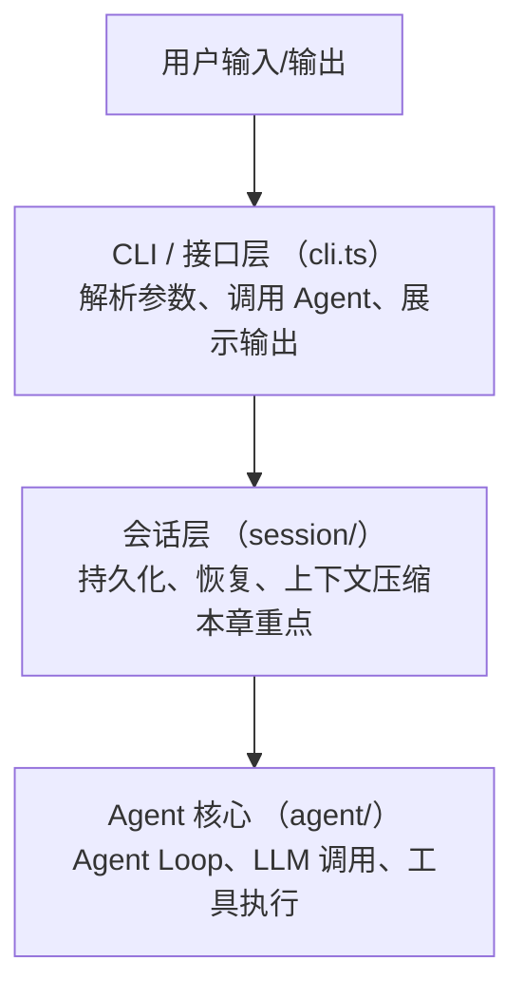
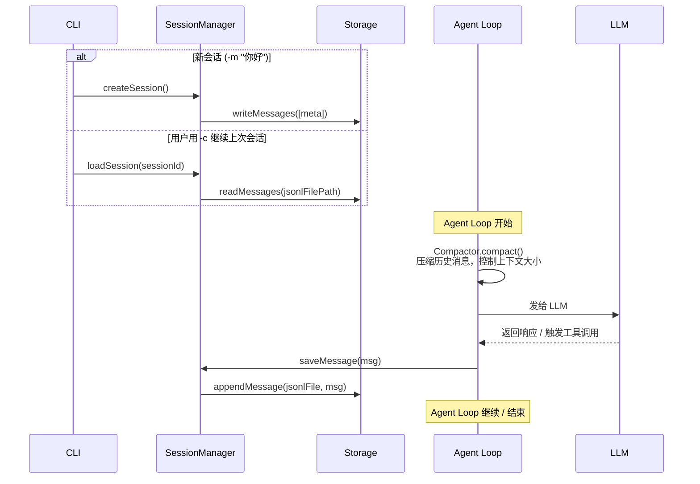
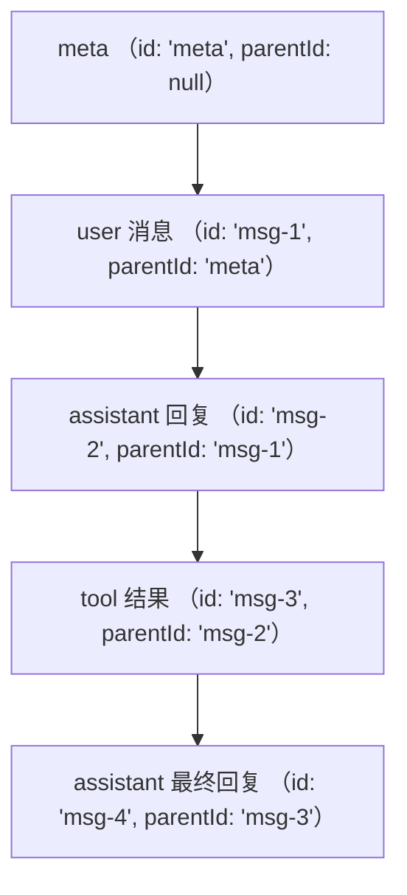

# 会话层 -- 持久化、恢复与上下文管理

> 会话层是 my-easy-pi 从"一次性对话"进化到"持久化交互"的关键。它负责将对话保存到磁盘、恢复历史会话，并通过压缩机制管理 LLM 上下文窗口。没有会话层，每次退出程序对话就会丢失。

## 会话层的角色

在 my-easy-pi 整体架构中，会话层处于 **CLI/接口层** 和 **Agent 核心** 之间，为整个系统提供"记忆"能力。



每次 Agent Loop 产生新消息时，会话层自动将消息写入磁盘；当用户通过 `-c` 恢复会话时，会话层从 JSONL 文件读取历史消息，再通过 Compactor 压缩后交给 Agent Loop。

## Learning objectives

理解 my-easy-pi 的会话层如何实现以下核心能力：

1. **理解会话层的定位** -- 会话层如何连接 CLI 层和 Agent 核心，作为"记忆"中间件
2. **掌握 JSONL 格式** -- 理解 JSON Lines 的读写特性，以及相比 JSON 数组的优势
3. **管理会话生命周期** -- 掌握 `SessionManager` 的 CRUD 操作：创建、加载、删除、列出、重命名
4. **实现会话恢复** -- 理解 `-c` 参数如何从磁盘恢复上次对话并发送给 LLM
5. **理解上下文压缩** -- 掌握 Compactor 的工作原理：什么时候压缩、压缩哪些内容、保留哪些消息
6. **理解 parentId 树** -- 理解消息通过 `id` + `parentId` 构建树形结构，支持对话分支
7. **学会排查问题** -- 当会话无法恢复、JSONL 文件损坏或压缩异常时，能独立定位并修复

## Prerequisites

- 了解 my-easy-pi 的基本 CLI 用法（`-c` 继续、`-l` 列表、`--delete` 删除等命令）
- 对 TypeScript 的 `async/await`、`fs/promises` 有基本了解
- 了解 [Agent Loop](../03-agent-layer/01-agent-loop.md) 的基本概念 -- LLM 调用和工具执行的循环过程
- 了解 LLM 上下文窗口的基本概念（Token 限制、滑动窗口等）

## Architecture diagram

### 会话层与 Agent Loop 的交互流程



### 数据流向（三阶段）

```mermaid
flowchart TD
    subgraph 阶段一["阶段一：启动时读取"]
        S1["JSONL 文件"] --> S2["Storage.readMessages（）"]
        S2 --> S3["Compactor.compact（）"]
        S3 --> S4["Agent Loop"]
    end

    subgraph 阶段二["阶段二：运行时写入"]
        R1["Agent Loop"] --> R2["saveMessage（）"]
        R2 --> R3["Storage.appendMessage（）"]
        R3 --> R4["JSONL 文件"]
    end

    subgraph 阶段三["阶段三：查看历史"]
        H1["CLI -l"] --> H2["SessionManager.listSessions（）"]
        H2 --> H3["Storage.listSessions（）"]
        H3 --> H4["会话列表"]
    end
```



## 文件列表

| 文件 | 说明 | 重要性 |
|------|------|--------|
| `src/session/manager.ts` | `SessionManager` -- 上层 CRUD 操作，会话生命周期的管理者 | ⭐⭐⭐ |
| `src/session/storage.ts` | JSONL 文件存储 -- 底层读写，直接操作文件系统 | ⭐⭐⭐ |
| `src/session/compaction.ts` | `Compactor` -- 上下文压缩器，控制发送给 LLM 的消息数量 | ⭐⭐ |
| `src/session/index.ts` | 统一导出入口 | ⭐ |

## Key concepts

### 1. 会话（Session）

一个会话对应一次用户与 Agent 的完整对话。每个会话由三个要素唯一标识：

- **sessionId** -- 格式为 `session-{timestamp}`，例如 `session-1692000000000`
- **JSONL 文件** -- 存储在 `~/.my-easy-pi/sessions/{sessionId}.jsonl`
- **元数据消息** -- 文件中的第一条消息（`id: 'meta'`）记录会话名称、创建时间、模型信息等

### 2. JSONL 存储格式

JSONL（JSON Lines）是每行一个 JSON 对象的文本格式。my-easy-pi 选择 JSONL 而非 JSON 数组，基于三个关键优势：

| 对比维度 | JSON 数组 | JSONL |
|----------|-----------|-------|
| 追加写入 | 需读取整个文件、解析、追加、序列化、重写 | 直接 `fs.appendFile` 追加一行 |
| 大文件读取 | 必须完整解析到内存 | 逐行读取，流式处理 |
| 部分读取 | 不支持 | 支持读取最后 N 条消息 |
| 树形结构 | 需要额外索引 | 通过 `id` + `parentId` 天然支持 |

### 3. parentId 树

每条消息都携带 `id` 和 `parentId` 字段，形成一棵对话树：



这种设计支持对话分支 -- 如果用户想"回到某个节点重新开始"，只需指定不同的 parentId。

### 4. 上下文压缩（Compaction）

当对话历史过长时，Compactor 会将早期消息合并为一条摘要，保留最近 N 条完整消息：

```
压缩前:
[消息 1] [消息 2] ... [消息 50] [消息 51] [消息 52]  → 共 52 条

压缩后:
[摘要消息] [消息 48] [消息 49] [消息 50] [消息 51] [消息 52]  → 共 6 条
```

压缩策略：早期消息由 LLM 生成摘要 -> 用摘要替换早期消息 -> 保留最新的完整轮次。

## Key design principles

### 1. 零依赖持久化

会话层不依赖数据库。所有存储基于 JSONL 文本文件和 Node.js 原生 `fs` 模块。这意味着：
- 无需安装数据库、配置连接、管理迁移
- 文件可读性强，可用 `cat`、`tail`、`jq` 直接查看
- 备份和迁移只需复制文件夹

### 2. 分层隔离

会话层分为三层，每层职责清晰：

```
SessionManager (业务逻辑)  →  关心"做什么"
     ↓
Storage (文件操作)         →  关心"怎么存"
     ↓
JSONL 文件                →  物理存储
```

上层不关心底层实现细节，底层不决定上层业务逻辑。

### 3. 安全第一

会话存储有防御性考虑：
- 对会话名称进行路径转义，防止路径遍历攻击
- 文件操作使用原子写入模式，防止写入中断导致数据损坏
- 元数据与消息内容分离，方便扩展而不破坏格式

## Reading order

1. **[01-session-manager.md](01-session-manager.md)** -- 先了解会话的增删改查，掌握会话生命周期的管理
2. **[02-jsonl-storage.md](02-jsonl-storage.md)** -- 理解底层 JSONL 存储格式和文件操作
3. **[03-context-compaction.md](03-context-compaction.md)** -- 掌握上下文压缩机制和压缩策略
4. **[practice.md](practice.md)** -- 动手练习巩固所学

## Summary and next steps

会话层实现了 my-easy-pi 的三个关键能力：

| 能力 | 实现文件 | 用户可见功能 |
|------|----------|-------------|
| **持久化** | `storage.ts` | 对话不丢失 |
| **恢复** | `manager.ts` | `-c` 继续会话、`-l` 列出会话 |
| **上下文管理** | `compaction.ts` | 长对话自动压缩，不超限 |

完成本章后，你已理解会话层的完整设计。下一步：

- 进入 [接口层](../07-interface-layer/README.md)，了解事件驱动如何将 Agent 输出渲染成用户可读的界面
- 或回顾 [Agent 层](../03-agent-layer/README.md)，加深对 Agent Loop 的理解

> ← [📚 返回学习指南](../README.md) · [下一章](../06-extension-layer/README.md) →
>
> → 下一篇: [01-session-manager.md](./01-session-manager.md)