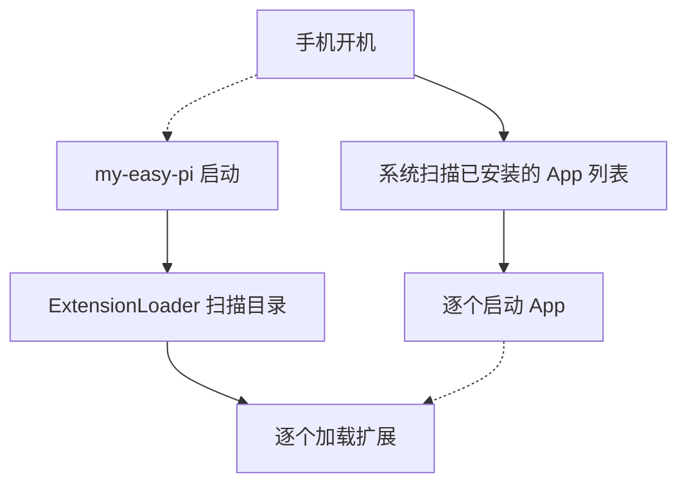
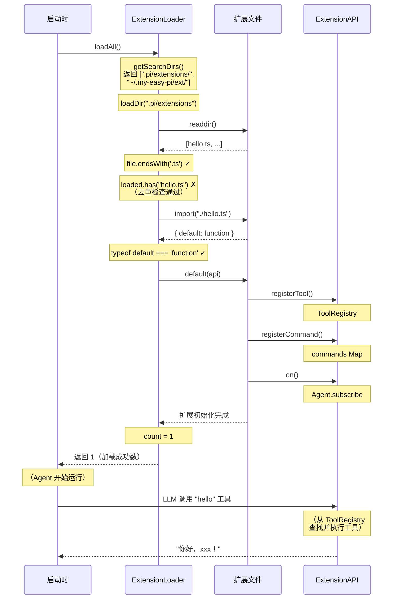

# ExtensionLoader — 扩展发现与加载

> 自动扫描、发现并动态加载扩展——让扩展"即放即用"

## 1. 本节目标

理解 `ExtensionLoader` 的实现原理，掌握扩展的发现机制、加载优先级和容错策略。

## 2. 前置知识

- 了解 `ExtensionAPI` 接口（见 `01-extension-api.md`）
- 了解 Node.js 的 `fs/promises` 和 `fs.existsSync`
- 了解 TypeScript 的 `import()` 动态导入语法
- 了解 `process.cwd()` 和 `os.homedir()` 的作用

## 3. 核心概念

### 3.1 用"手机 App 安装"来理解扩展加载

如果你阅读了上一章中"用手机 App 来理解扩展"的类比，那么 `ExtensionLoader` 的角色就相当于**手机的开机启动过程**：



具体对应关系：

| 手机 App 安装流程 | ExtensionLoader 的对应步骤 |
|-------------------|---------------------------|
| 从 App Store 下载 App 安装包 | 用户将扩展文件放入 `~/.my-easy-pi/extensions/` |
| 手机开机 | my-easy-pi 启动，调用 `loadAll()` |
| 系统扫描已安装的 App 列表 | `getSearchDirs()` 获取扩展目录 |
| 系统检查 App 的签名和 manifest | 检查文件是否为 `.ts/.js`、`default` 导出是否为函数 |
| 系统启动 App（调用 main 函数） | `import()` 动态导入 + 调用 `default()` 函数 |
| App 注册自己的服务（如推送通知） | 扩展调用 `api.registerTool()` 等注册能力 |
| 某个 App 崩溃，不影响其他 App | 单个扩展 `import()` 失败，不影响其他扩展 |

> **本质**：`ExtensionLoader` 就是一个"扩展启动器"，它的工作就是找到扩展文件、验证格式、执行初始化。

### 3.2 扩展加载器的工作流程

```mermaid
flowchart TD
    A[loadAll() 被调用] --> B[getSearchDirs() 获取搜索目录列表]
    B --> C1["1. 项目目录: {projectDir}/.pi/extensions/"]
    B --> C2["2. 全局目录: ~/.my-easy-pi/extensions/"]
    C1 --> D[遍历每个目录，跳过不存在的目录]
    C2 --> D
    D --> E[loadDir() 读取目录下的所有文件]
    E --> F1[过滤 .ts / .js 文件]
    E --> F2[跳过已加载的文件（去重）]
    F1 --> G[对每个文件执行 import() 动态导入]
    F2 --> G
    G --> H1[检查 default 导出是否为函数]
    G --> H2[调用函数，传入 ExtensionAPI 实例]
    G --> H3[加载成功 → count++]
    G --> H4[加载失败 → 捕获异常，继续下一个]
```

### 3.3 加载优先级

扩展加载按以下优先级搜索：

| 优先级 | 目录 | 路径 | 适用场景 |
|--------|------|------|----------|
| 高 | 项目目录 | `{projectDir}/.pi/extensions/` | 项目级扩展，随项目分发 |
| 低 | 全局目录 | `~/.my-easy-pi/extensions/` | 用户级扩展，全局可用 |

> **注意**: 当前实现中，`getSearchDirs()` 返回的目录列表只有两个。如果后续需要支持 CLI 参数指定路径，可以在该方法中增加一个动态注入的路径。

### 3.4 容错设计

`ExtensionLoader` 采用了多层容错策略：

1. **目录不存在** — `loadDir()` 中捕获 `readdir` 的异常，跳过不存在的目录
2. **文件加载失败** — 单个扩展的 `import()` 失败不会影响其他扩展
3. **导出非函数** — 跳过 `default` 导出不是函数的模块
4. **去重保护** — 通过 `loaded` Set 防止同一文件被重复加载

## 4. 代码实现

### 4.1 完整源码

```typescript
// ============================================================
// ExtensionLoader — 扩展加载器
//
// 职责：自动发现并加载扩展文件
//
// 搜索路径（按优先级）：
//   1. 项目目录  .pi/extensions/*.ts   ← 随项目版本控制的扩展
//   2. 全局目录  ~/.my-easy-pi/extensions/*.ts  ← 用户全局安装的扩展
//
// 加载流程（对每个文件）：
//   1. 过滤：只接受 .ts 和 .js 文件
//   2. 去重：已加载的同名文件不再加载
//   3. 导入：使用动态 import() 加载模块
//   4. 验证：检查 default 导出是否为函数
//   5. 初始化：调用 default(api) 执行扩展的入口函数
//
// 容错原则：单个扩展的失败不影响其他扩展
// ============================================================

import { readdir } from 'fs/promises'    // readdir：读取目录内容（Promise 版本）
import { existsSync } from 'fs'           // existsSync：同步检查文件/目录是否存在
import { homedir } from 'os'              // homedir：获取当前用户的主目录路径
import { join } from 'path'               // join：跨平台路径拼接
import type { ExtensionAPI } from './api.js'  // ExtensionAPI 类型

/**
 * ExtensionLoader — 扩展加载器
 *
 * 实现了扩展的自动发现、按优先级加载和容错处理。
 * 核心方法是 loadAll()，在 my-easy-pi 启动时被调用。
 *
 * 使用示例：
 *   const loader = new ExtensionLoader(api)
 *   const count = await loader.loadAll()
 *   console.log(`成功加载 ${count} 个扩展`)
 */
export class ExtensionLoader {
  // 已加载的文件名集合，用于去重
  // 选择 Set 数据结构：自动保证元素唯一性，查找效率 O(1)
  // 注意：这里用的是文件名（如 "hello.ts"）而非完整路径
  private loaded = new Set<string>()

  // 构造函数：接收两个参数
  // api       — 所有扩展共享同一个 ExtensionAPI 实例
  //             （这样扩展注册的工具会合并到同一个注册表）
  // projectDir — 项目根目录，默认 process.cwd()
  //              （可注入，方便测试时指定不同路径）
  constructor(
    private api: ExtensionAPI,
    private projectDir: string = process.cwd(),
  ) {}

  /**
   * loadAll — 加载所有扩展
   *
   * 遍历所有搜索目录，加载每个目录中的扩展文件。
   * 返回成功加载的扩展总数。
   *
   * 返回值用途：
   *   - 日志输出："已加载 3 个扩展"
   *   - 健康检查：如果为 0，可能提示用户未安装扩展
   */
  async loadAll(): Promise<number> {
    let count = 0
    const dirs = this.getSearchDirs()

    for (const dir of dirs) {
      // 先检查目录是否存在，避免不必要的异步 readdir 调用
      // existsSync 是同步的，但在这里可以提前过滤无效路径
      if (!existsSync(dir)) continue
      count += await this.loadDir(dir)
    }

    return count
  }

  /**
   * getSearchDirs — 获取搜索目录列表
   *
   * 返回按优先级排列的目录列表。
   * 数组顺序即优先级顺序：索引越小，优先级越高。
   * 高优先级目录中的文件会"覆盖"低优先级目录中的同名文件（去重效果）。
   *
   * 扩展路径说明：
   *   - .pi/extensions/：点开头的目录，通常会被 git 忽略
   *     但 .pi/ 本身可以被版本控制，方便团队共享扩展
   *   - ~/.my-easy-pi/extensions/：用户级别的扩展，所有项目共用
   */
  private getSearchDirs(): string[] {
    return [
      join(this.projectDir, '.pi', 'extensions'),     // ← 优先级高
      join(homedir(), '.my-easy-pi', 'extensions'),       // ← 优先级低
    ]
  }

  /**
   * loadDir — 加载单个目录下的所有扩展文件
   *
   * 双层 try-catch 设计：
   *   - 外层 catch：处理 readdir 错误（目录不存在、无读取权限）
   *   - 内层 catch：处理单个文件的 import/执行错误
   *
   * 这种设计确保了"错误隔离"——
   *   任何单个文件的失败都不会影响其他文件的加载
   */
  private async loadDir(dir: string): Promise<number> {
    let count = 0
    try {
      const files = await readdir(dir)

      for (const file of files) {
        // ★ 文件过滤：只处理 .ts 和 .js 文件
        // 不处理 .d.ts（类型声明）、.map（sourcemap）、.json 等
        if (!file.endsWith('.ts') && !file.endsWith('.js')) continue

        // ★ 去重保护：跳过已加载的文件
        // 这就是"项目级扩展覆盖全局扩展"的实现原理——
        // 项目目录先被遍历，同名文件先被加入 loaded Set
        // 全局目录中的同名文件因为已经 loaded，所以被跳过
        if (this.loaded.has(file)) continue
        this.loaded.add(file)

        // 内层 try-catch：隔离单个文件的加载错误
        try {
          const fullPath = join(dir, file)
          // ★ 动态导入：Node.js 原生支持的运行时加载
          // import() 返回 Promise，所以要用 await
          // 这也是扩展文件需要是 .ts/.js 的原因（Node.js 支持格式）
          const mod = await import(fullPath)

          // ★ 格式验证：检查 default 导出是否为函数
          // 这就是为什么扩展文件必须 "export default function"
          // 如果导出的是对象、类等，会被静默跳过
          if (typeof mod.default === 'function') {
            // 调用扩展的入口函数，传入 API 实例
            // 扩展在此函数中调用 api.registerTool() 等注册能力
            await mod.default(this.api)
            count++
          }
          // 非函数导出：静默跳过，不报错也不计数
        } catch {
          // 单个扩展加载失败：静默捕获，不影响其他扩展
          // 可能的原因：语法错误、import 依赖缺失、扩展内部异常
        }
      }
    } catch {
      // 目录读取失败：静默捕获，继续下一个搜索目录
      // 可能的原因：目录不存在、权限不足
    }
    return count
  }
}
```

### 4.2 逐行注释解读

**构造函数**（第 20-24 行）：
```typescript
constructor(
  private api: ExtensionAPI,
  private projectDir: string = process.cwd(),
) {}
```
- `api` — 所有扩展共享同一个 `ExtensionAPI` 实例，这样扩展注册的工具和命令会合并到同一个注册表中
- `projectDir` — 项目根目录，默认值为 `process.cwd()`，方便测试时注入不同的路径

**loadAll**（第 26-37 行）：
```typescript
async loadAll(): Promise<number> {
  let count = 0
  const dirs = this.getSearchDirs()
  for (const dir of dirs) {
    if (!existsSync(dir)) continue
    count += await this.loadDir(dir)
  }
  return count
}
```
- 先检查目录是否存在（`existsSync`），避免不必要的异步操作
- 按优先级顺序依次加载，返回成功加载的扩展总数
- 返回值可用于日志输出，例如 `加载了 3 个扩展`

**getSearchDirs**（第 39-45 行）：
```typescript
private getSearchDirs(): string[] {
  return [
    join(this.projectDir, '.pi', 'extensions'),
    join(homedir(), '.my-easy-pi', 'extensions'),
  ]
}
```
- 项目级扩展放在 `.pi/extensions/` 目录下，随项目一起版本控制
- 全局扩展放在 `~/.my-easy-pi/extensions/` 目录下，用户全局可用
- 数组顺序即优先级顺序

**loadDir**（第 47-72 行）：
```typescript
private async loadDir(dir: string): Promise<number> {
  let count = 0
  try {
    const files = await readdir(dir)
    for (const file of files) {
      if (!file.endsWith('.ts') && !file.endsWith('.js')) continue
      if (this.loaded.has(file)) continue
      this.loaded.add(file)

      try {
        const fullPath = join(dir, file)
        const mod = await import(fullPath)
        if (typeof mod.default === 'function') {
          await mod.default(this.api)
          count++
        }
      } catch {
        // 单个扩展加载失败不影响其他扩展
      }
    }
  } catch {
    // 目录不存在或无法读取时跳过
  }
  return count
}
```

关键设计点：

1. **文件过滤**（第 52 行）— 只加载 `.ts` 和 `.js` 文件，其他文件（如 `.map`、`.d.ts`）被忽略
2. **去重保护**（第 53-54 行）— `loaded` Set 用于防止同一文件被重复加载。注意这里的 key 是文件名 `file`（如 `hello.ts`），而不是完整路径，这意味着不同目录下的同名文件只会加载第一个
3. **双层 try-catch**（第 57-63 行和第 64-68 行）— 外层 catch 处理目录读取错误，内层 catch 处理单个文件加载错误，确保错误隔离
4. **动态导入**（第 59 行）— 使用 `import(fullPath)` 实现运行时加载，这是 Node.js 原生支持的动态导入语法
5. **函数检查**（第 60 行）— 只有 `default` 导出为函数的模块才被视为有效扩展

### 4.3 扩展加载的生命周期：完整的时序图

结合上一章的 `ExtensionAPI`，一个扩展从文件到可用的完整过程如下：



#### 4.3.1 加载阶段的容错流程

```mermaid
flowchart TD
    A[loadDir(dir)] --> B[try:]
    B --> C[readdir(dir)]
    C -->|"可能失败（目录不存在、无权限）"| D[catch]
    D --> E[返回 0（跳过该目录）]
    B --> F[for each file:]
    F --> G[过滤非 .ts/.js<br/>不报错，直接跳过]
    F --> H[去重检查<br/>跳过已加载文件]
    F --> I[try:]
    I --> J[import()<br/>可能失败（语法错误、依赖缺失）]
    I --> K[检查 default 导出<br/>非函数则跳过（不报错）]
    I --> L[执行 default()<br/>可能失败（扩展内部错误）]
    I --> M[catch:<br/>静默捕获，继续下一个文件<br/>跳过此文件，不影响其他扩展]
    B --> N[返回 count]
    A --> O[catch:<br/>跳过此目录，继续下一个搜索目录]
```

## 5. 运行与验证

### 5.1 手动测试加载器

```bash
# 创建测试目录结构
mkdir -p /tmp/test-extensions/.pi/extensions
mkdir -p /tmp/test-extensions-global/.my-easy-pi/extensions

# 创建测试扩展
cat > /tmp/test-extensions/.pi/extensions/hello.ts << 'EOF'
export default async function (api: any) {
  console.log('[扩展] 项目级扩展加载成功')
}
EOF

cat > /tmp/test-extensions-global/.my-easy-pi/extensions/hello.ts << 'EOF'
export default async function (api: any) {
  console.log('[扩展] 全局扩展加载成功')
}
EOF
```

### 5.2 验证加载优先级

```bash
# 项目级扩展会覆盖全局扩展（同名文件只加载第一个）
# 如果两个目录都有 hello.ts，只有项目目录下的会被加载
echo "验证：去重机制确保同名文件不重复加载"
```

### 5.3 验证容错

```bash
# 创建一个会报错的扩展
cat > /tmp/test-extensions/.pi/extensions/broken.ts << 'EOF'
export default async function (api: any) {
  throw new Error('加载失败')
}
EOF

# 验证：broken.ts 加载失败，但 hello.ts 仍能正常加载
```

## 6. 小结

`ExtensionLoader` 实现了扩展的自动发现、按优先级加载和容错处理。通过简单的目录约定和动态导入机制，扩展实现了"即放即用"的体验。

### 当前设计的局限

1. **去重粒度** — 去重使用文件名而非完整路径，同名文件在不同目录下只会加载第一个
2. **无卸载机制** — 扩展加载后无法卸载，`loaded` Set 只增不减
3. **无依赖管理** — 扩展之间没有依赖声明和能力发现机制
4. **无热更新** — 扩展只在启动时加载一次，运行中新增的扩展文件不会被检测到

### 思考题

1. 如果想让扩展支持热更新（文件变化时自动重新加载），`ExtensionLoader` 需要做哪些改动？
2. 当前去重使用文件名（`file`）而非完整路径（`fullPath`），这会导致什么问题？如何修复？
3. 为什么 `loadDir` 中 `loaded.add(file)` 放在 `import()` 之前而不是之后？

> ← [上一节](./01-extension-api.md) · [下一节](./practice.md) →
>
> [📚 返回章节首页](../06-extension-layer/README.md)