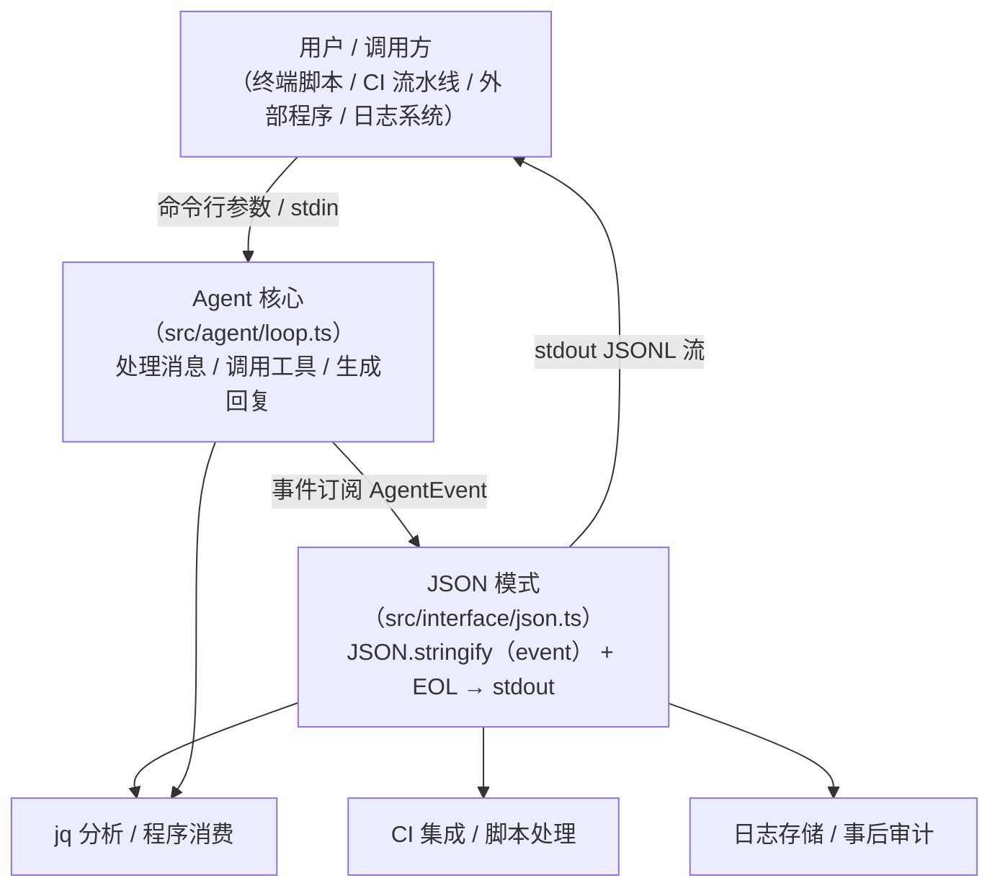

# JSON 模式 — JSONL 事件流输出

| 元信息 | 内容 |
|--------|------|
| 对应源码 | `src/interface/json.ts` |
| 最后更新 | 2026-08-10 |
| 适用版本 | my-easy-pi v0.1.0 |

---

## 1. 本节目标

理解 JSON 模式的设计与实现：将 Agent 事件以 JSONL（每行一个 JSON 对象）格式输出到 stdout，适合程序消费、CI 集成和日志分析场景。

---

## 2. 前置知识

- JSON 序列化与反序列化
- JSONL（JSON Lines）格式规范
- 基本的 `jq` 命令使用

---

## 3. 核心概念

### 3.1 JSON 模式在整个数据流中的位置

以下架构图展示了 JSON 模式在 my-easy-pi 整体数据流中的位置：



**关键的分层**：
- **Agent 核心**：负责处理消息、调用工具，对输出格式一无所知
- **JSON 模式**：每个事件到达时，直接序列化为一行 JSON，不做任何过滤或累积
- **下游消费者**：通过 `jq`、管道、日志系统等工具处理 JSONL 流

### 3.2 JSONL 与 JSON 数组的差异

JSONL 的核心思想是：**每一行都是一个完整的、自包含的 JSON 对象**。这与传统的 JSON 数组格式有本质区别。

**类比：流水线上的产品**

> **JSON 数组** = 你要等整条流水线跑完，把所有产品收集到一个大箱子（数组）里，然后一次性搬走。你不能在流水线跑完之前拿到任何一个产品。
>
> **JSONL** = 流水线上的每个产品做好后，立刻单独打包放在传送带上。你可以在第一个产品做好时就拿起来检查，不需要等整条流水线结束。

**具体对比**：

| 特性 | JSON 数组格式 | JSONL 格式 |
|------|-------------|-----------|
| 格式 | `[{"a":1},{"a":2}]` | `{"a":1}\n{"a":2}\n` |
| 解析方式 | 需完整读入后 `JSON.parse()` | 逐行读取，行行独立解析 |
| 流式处理 | 不支持（必须等 `]` 闭合） | 天然支持 |
| 内存占用 | O(n)，整个数组在内存中 | O(1)，一次只处理一行 |
| 追加数据 | 需要找到 `]` 之前的插入点 | 直接 append 新行 |
| 中断恢复 | 丢失全部数据 | 已处理的行不会丢失 |
| 管道兼容 | 与 `head`、`tail` 等工具不兼容 | 完全兼容 |

**JSONL 在程序中的表现**：

```typescript
// 读取 JSON 数组：必须等待完整 payload
const response = await fetch(url)
const data = await response.json()   // 等待整个响应体
for (const item of data) { ... }     // 然后才能遍历

// 读取 JSONL 流：可以逐行处理
const stream = fetch(url).then(r => r.body)
const reader = stream.getReader()
while (true) {
  const line = await readNextLine(reader)  // 来一行处理一行
  const event = JSON.parse(line)
  handleEvent(event)
}
```

### 3.3 无状态输出

JSON 模式不维护任何状态——它不追踪内容长度，不记录已输出位置，每次收到事件就直接序列化整行输出。这是与 Print 模式最大的设计差异。

```typescript
// Print 模式（有状态）
let lastContentLength = 0  // ← 维护状态
const newPart = content.slice(lastContentLength)  // ← 依赖状态
lastContentLength = content.length  // ← 更新状态

// JSON 模式（无状态）
const json = JSON.stringify(event) + EOL  // ← 直接输出，没有状态变量
process.stdout.write(json)
```

### 3.4 完整事件透明

JSON 模式输出 **所有** 事件类型，而 Print 模式只输出了部分对用户可见的事件。这使得 JSON 输出可用于调试、审计和自动化分析。

### 3.5 事件类型速查表

以下是 JSON 模式输出的每种事件类型及其用途：

| 事件类型 | 触发时机 | 典型用途 | 是否包含 `message.content` |
|----------|----------|----------|--------------------------|
| `agent_start` | Agent 开始处理请求 | 标记一次交互的起点 | 否 |
| `agent_end` | Agent 完成所有处理 | 获取完整对话记录，后续可回放 | 是（完整消息列表） |
| `turn_start` | 单轮对话开始 | 在多轮对话中标记轮次边界 | 否 |
| `turn_end` | 单轮对话结束 | 获取本轮完整对话上下文 | 是（含工具结果） |
| `message_start` | LLM 开始生成消息 | 标记消息开始，可用于显示"正在生成..." | 是（空内容） |
| `message_update` | LLM 逐 token 生成内容 | 实时流式显示、逐字渲染 | 是（累计内容） |
| `message_end` | 消息生成完成 | 获取最终完整消息对象、ID 信息 | 是（完整内容） |
| `tool_execution_start` | 工具开始执行 | 日志记录、耗时统计 | 否（工具名称和参数） |
| `tool_execution_update` | 工具执行过程中 | 进度条显示、分段结果输出 | 是（部分结果） |
| `tool_execution_end` | 工具执行完成 | 获取最终工具结果、审计 | 是（最终结果） |
| `error` | 发生错误 | 告警、重试策略、错误分析 | 是（错误信息） |

---

## 4. 代码实现

### 4.1 完整源码

文件位置：`src/interface/json.ts`

```typescript
import { EOL } from 'os'
import type { Agent, AgentEvent } from '../agent/index.js'

/** 创建 JSON 输出接口 */
export function createJSONInterface(agent: Agent): void {
  agent.subscribe((event: AgentEvent) => {
    const json = JSON.stringify(event) + EOL
    process.stdout.write(json)
  })
}
```

### 4.2 逐行注释解释

| 行号 | 代码 | 说明 |
|------|------|------|
| 1 | `import { EOL } from 'os'` | 导入系统换行符 |
| 2 | `import type { Agent, AgentEvent }` | 仅导入类型声明 |
| 5 | `export function createJSONInterface` | 导出工厂函数，接收 Agent 实例 |
| 6 | `agent.subscribe(...)` | 订阅所有 Agent 事件 |
| 7 | `JSON.stringify(event) + EOL` | 将事件序列化为 JSON 字符串并追加换行 |
| 8 | `process.stdout.write(json)` | 写入标准输出 |

### 4.3 输出示例

当用户输入 "你好" 时，JSON 模式的输出大致如下：

```jsonl
{"type":"agent_start"}
{"type":"message_start","message":{"id":"msg-...","role":"assistant","content":""}}
{"type":"message_update","message":{"content":"你"}}
{"type":"message_update","message":{"content":"你好"}}
{"type":"message_update","message":{"content":"你好！有什么我可以帮你的吗？"}}
{"type":"message_end","message":{"id":"msg-...","role":"assistant","content":"你好！有什么我可以帮你的吗？"}}
{"type":"agent_end","messages":[...]}
```

如果涉及工具调用，还会出现工具相关事件：

```jsonl
{"type":"tool_execution_start","name":"search","arguments":{"q":"今日天气"}}
{"type":"tool_execution_update","result":{"partial":"晴转多云"}}
{"type":"tool_execution_end","result":{"full":"28°C，晴转多云，适合出行"}}
```

---

## 5. 运行与验证

### 5.1 基本使用

```bash
# 启动 JSON 模式
my-easy-pi -m "你好" --output json
```

预期输出（实例如下，以 `jq` 格式化后展示）：

```bash
$ my-easy-pi -m "用中文说 hello" --output json | jq '.type'
"agent_start"
"message_start"
"message_update"
"message_update"
"message_end"
"agent_end"
```

### 5.2 使用 jq 工具分析（实战示例）

**注意**：以下示例假设 my-easy-pi 的 `--output json` 模式已实现。如果当前版本尚未内置，可以通过 RPC 模式或直接调用底层 API 获得类似 JSONL 输出。

#### 示例 1：过滤特定事件

```bash
# 只查看 message_update 事件
my-easy-pi -m "你好" --output json \
  | jq 'select(.type == "message_update")'

# 输出：
# {"type":"message_update","message":{"content":"你"}}
# {"type":"message_update","message":{"content":"你好"}}
# ...
```

#### 示例 2：提取实时内容

```bash
# 从 message_update 中提取内容（去除外层引号）
my-easy-pi -m "你好" --output json \
  | jq -r 'select(.type == "message_update") | .message.content'

# 输出：
# 你
# 你好
# 你好！有什么我可以帮你的吗？
```

#### 示例 3：统计事件分布

```bash
# 统计各类事件的数量
my-easy-pi -m "搜索天气" --output json \
  | jq -r '.type' \
  | sort \
  | uniq -c \
  | sort -rn

# 输出：
#    3 message_update
#    1 tool_execution_start
#    1 tool_execution_end
#    1 message_start
#    1 message_end
#    1 agent_start
#    1 agent_end
```

#### 示例 4：获取最终响应内容

```bash
# 提取 message_end 中的完整内容
my-easy-pi -m "你好" --output json \
  | jq -r 'select(.type == "message_end") | .message.content'
```

#### 示例 5：格式化事件为更可读的格式

```bash
# 使用 jq 的格式化能力，让每条事件更清晰
my-easy-pi -m "你好" --output json \
  | jq 'select(.type == "message_end") | {type, role: .message.role, content_preview: (.message.content[:50])}'

# 输出：
# {
#   "type": "message_end",
#   "role": "assistant",
#   "content_preview": "你好！有什么我可以帮你的吗？"
# }
```

#### 示例 6：实时监控（搭配 watch）

```bash
# 每 5 秒检查一次最新事件
watch -n 5 "my-easy-pi -m '查看系统状态' --output json \
  | jq -r 'select(.type == \"message_end\") | .message.content'"
```

### 5.3 CI/CD 集成最佳实践

#### 场景 1：提取 Agent 输出到文件

```bash
# 在 CI 脚本中获取 Agent 输出并提取关键信息
my-easy-pi -m "分析 CHANGELOG.md 并提取最近的版本号" --output json \
  | jq -r 'select(.type == "message_end") | .message.content' \
  > release_notes.md
```

#### 场景 2：按事件类型分流处理

```yaml
# .github/workflows/agent-ci.yml
jobs:
  agent-task:
    runs-on: ubuntu-latest
    steps:
      - uses: actions/checkout@v4
      - name: Run my-easy-pi analysis
        run: |
          my-easy-pi -m "审查代码变更" --output json > events.jsonl
          # 提取最终结论
          jq -r 'select(.type == "message_end") | .message.content' events.jsonl > conclusion.md
          # 提取工具调用结果
          jq -r 'select(.type == "tool_execution_end") | .result' events.jsonl > tool_results.json
      - name: Upload analysis artifacts
        uses: actions/upload-artifact@v4
        with:
          name: agent-analysis
          path: |
            conclusion.md
            tool_results.json
            events.jsonl
```

#### 场景 3：日志归档与分析

```bash
# 将 JSONL 输出追加到日志文件
my-easy-pi -m "执行巡检任务" --output json >> agent-audit-$(date +%Y%m%d).jsonl

# 事后分析：查询某天的所有工具调用
jq -r 'select(.type == "tool_execution_start") | "\(.name): \(.arguments)"' agent-audit-20260810.jsonl
```

#### 场景 4：管道链式处理

```bash
# 多层管道处理
my-easy-pi -m "找出最大的三个文件" --output json \
  | jq -r 'select(.type == "message_end") | .message.content' \
  | head -5 \
  | awk '{print $1, $2}'
```

### 5.4 调试用途

JSON 模式完整保留了工具调用信息，非常适合调试：

```bash
# 查看工具执行事件
my-easy-pi -m "搜索今天的天气" --output json \
  | jq 'select(.type | startswith("tool_execution"))'
```

```bash
# 查看完整的请求-响应周期
my-easy-pi -m "帮我搜索 my-easy-pi 文档" --output json \
  | jq -c 'select(.type | test("^(agent|turn|tool_execution)"))'
```

---

## 6. 常见问题（FAQ）

### Q1: JSONL 输出是原子写入的吗？会不会出现半行？

**存在这种可能**。`process.stdout.write()` 是异步的，在高频写入时可能出现输出混在一起的情况。但 JSON 模式的每次写入量很小（几百字节到几 KB），且 Node.js 的输出缓冲区通常能保证写入完整性。如果需要绝对保证，可以使用 `Transform` 流或加锁机制。

### Q2: 如果事件对象很大，JSON.stringify 会阻塞线程吗？

会的。`JSON.stringify` 是同步操作，如果事件对象包含大量数据（如完整的对话历史），序列化可能会导致几毫秒到几十毫秒的阻塞。对于大多数场景这不是问题，但如果需要极致性能，可以考虑使用流式 JSON 序列化库（如 `stream-json`）。

### Q3: JSON 模式如何处理大模型输出的特殊字符？

`JSON.stringify` 会自动转义控制字符、引号和反斜线等特殊字符。例如，如果 LLM 输出了包含 `"` 和 `\n` 的内容，它们会被正确转义为 `\"` 和 `\\n`，确保输出始终是合法的 JSON。但需要注意的是，`\n` 在 JSON 字符串中是换行符，逐行读取 JSONL 时需要正确反序列化。

### Q4: 为什么 JSON 模式不把错误输出到 stderr？

Print 模式把错误写到 stderr 是为了让管道不受污染。但 JSON 模式的输出已经是结构化数据，下游程序通过 `event.type === "error"` 来识别错误。如果把错误写到 stderr，反而会破坏管道完整性——下游程序需要同时读取 stdout 和 stderr 两条流，增加了复杂度。所以 JSON 模式将所有输出（包括错误）都放在 stdout，统一由事件类型区分。

### Q5: JSONL 每一行末尾的换行符是 LF 还是 CRLF？

取决于运行平台。代码中使用 `import { EOL } from 'os'`，在 Linux/macOS 上使用 LF（`\n`），在 Windows 上使用 CRLF（`\r\n`）。大多数 JSONL 工具的默认行尾是 LF，所以如果在 Windows 上使用，建议用 `dos2unix` 或其他工具转换，以确保与 `jq` 等工具兼容。

---

## 7. 小结

JSON 模式是四种模式中最简洁的实现——仅 8 行代码（不含注释）。它通过将 Agent 事件完整地序列化为 JSONL 格式，实现了"机器可读"这一核心目标。无论是配合 `jq` 做数据分析，还是集成到 CI 流水线，JSON 模式都提供了充足的灵活性。

核心要点回顾：

- **JSONL 格式**：每行独立 JSON，流式友好，内存高效，工具兼容
- **无状态设计**：与 Print 模式的有状态增量输出形成对比，简单到极致
- **完整事件透明**：输出所有事件类型，适合调试、审计和自动化
- **CI/CD 友好**：标准输出可直接用于脚本、管道和日志系统

### 思考题

1. JSON 模式为什么不使用增量输出（像 Print 模式那样）？
2. 如果事件中包含循环引用，`JSON.stringify` 会怎样？应如何避免？
3. 如何修改 JSON 模式使其输出为 JSON 数组格式（`[...]`）而不是 JSONL？这样做有什么优缺点？
4. 在设计一个需要同时对接人类终端和 CI 脚本的 Agent 时，Print 模式和 JSON 模式分别适合什么角色？能否同时启动？

> ← [上一节](./01-print-mode.md) · [下一节](./03-rpc-mode.md) →
>
> [📚 返回章节首页](../07-interface-layer/README.md)