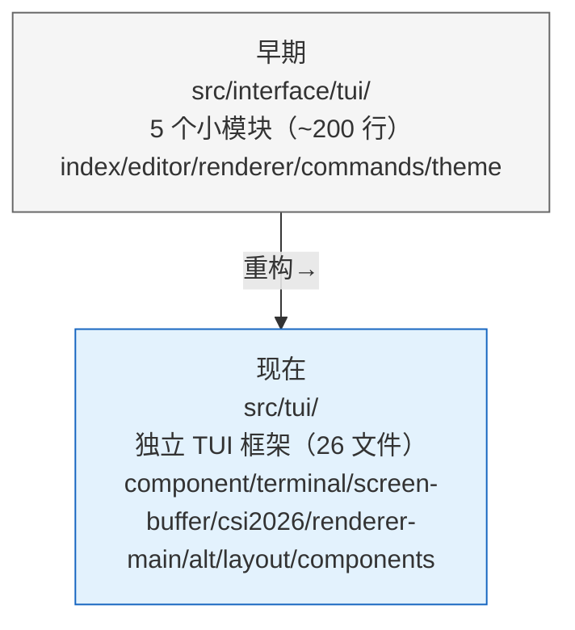
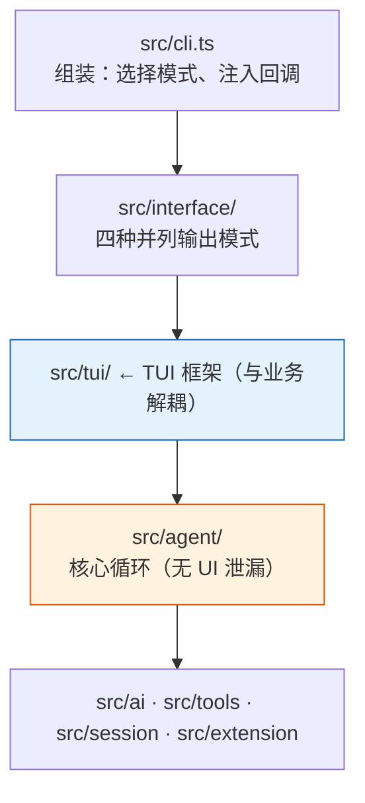
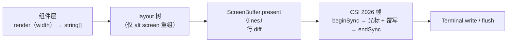
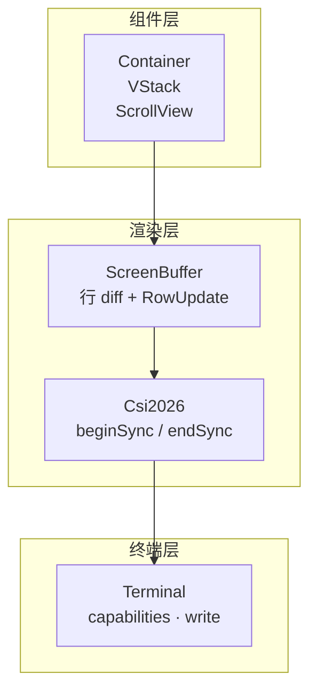

# TUI 模式 — 全屏终端交互界面

| 元信息 | 内容 |
|--------|------|
| 对应源码 | `src/tui/`（新框架）· `src/interface/tui/`（slash 命令） |
| 最后更新 | 2026-08-09 |
| 适用版本 | my-easy-pi v0.1.0+ |
| 设计文档 | [docs/tui-strategy.md](../tui-strategy.md) |

---

## 1. 本节目标

理解 TUI（Terminal User Interface）模式的设计与实现。my-easy-pi 的 TUI 已经从早期 `src/interface/tui/`（基于 readline 的 5 个小模块）演进为 `src/tui/` 下**独立的极简终端 UI 框架**（内部代号 `@my-easy-pi/tui`）：单接口双渲染器、三方法组件契约、差分渲染 + CSI 2026 同步输出。学习本节后，你将理解：

- 如何用 alternate screen 实现全屏交互
- `Component` / `TUI` 核心契约如何让业务与渲染解耦
- 主屏（`TuiMainScreen`）与全屏（`TuiAltScreen`）两种渲染器的差异
- 组件 → 布局 → 行 diff → CSI 2026 的完整渲染管线

---

## 2. 前置知识

- ANSI 转义序列基础
- 终端 alternate screen 概念
- 事件发布/订阅模式（`agent.subscribe(AgentEvent)`）
- 依赖注入思想（`startTUI` 通过 options 注入依赖）

---

## 3. 核心概念

### 3.1 Alt Screen 模式

TUI 使用终端的 alternate screen 缓冲区（通过 `\x1b[?1049h` 进入，`\x1b[?1049l` 退出），类似于 `vim`、`htop` 等工具的全屏效果：

- **进入时**：保存当前终端内容，切换到独立的缓冲区
- **退出时**：恢复原始终端内容，并**把 transcript 完整回放到主屏**（供 grep / tmux copy）
- **光标隐藏**：进入时隐藏光标，退出时恢复

### 3.2 演进历程



### 3.3 分层架构



**设计原则：依赖只能向下。** `src/agent/` 不 import 任何 TUI / stdout / readline；TUI 框架自身也不 import 业务模块。业务组件通过 `agent.subscribe(AgentEvent)` 驱动，核心零感知。

### 3.4 核心契约 — Component / TUI

所有 UI 元素都实现 `Component` 接口（来源：[component.ts](file:///workspace/src/tui/component.ts)）：

```typescript
export interface Component {
  /** 渲染成若干行字符串（已含 ANSI 转义序列）；宽度外的裁切由渲染器负责 */
  render(width: number): string[]
  /** 可选：处理键盘原始输入（如 ESC/console 序列） */
  handleInput?(data: string): void
  /** 可选：声明想收键释放事件（kitty 协议） */
  wantsKeyRelease?: boolean
  /** 失效内部缓存；下一次 render 必须重新计算 */
  invalidate(): void
}
```

关键约束：
- **组件不接收事件回调 props**——业务侧通过订阅 `AgentEvent` + 调 `component.invalidate()` + `tui.requestRender()` 驱动
- **焦点用类型守卫而非继承**——`isFocusable(c)` 判断组件是否可聚焦，避免强行继承
- **任何 stdout 写入必须经 `Terminal`**——业务侧直接 `process.stdout.write` 视为 bug

`TUI` 接口定义了渲染器抽象（`src/tui/component.ts`），业务侧只跟它打交道：

```typescript
export interface TUI {
  registerComponent(c: Component): void
  unregisterComponent(c: Component): void
  dock(position: 'top' | 'bottom', c: Component): void   // 钉在边缘（main screen 忽略）
  setMain(c: Component): void
  requestRender(): void                                   // 高频调用安全，内部去抖
  showOverlay(c: Component, opts?: OverlayOptions): OverlayHandle
  closeOverlay(h: OverlayHandle): void
  start(): Promise<void> | void
  stop(): Promise<void> | void                            // alt screen: 退出时回放 transcript
}
```

### 3.5 双渲染器

同一个 `TUI` 接口，两种实现，可互换：

| 渲染器 | 源码 | 行为 |
|--------|------|------|
| `TuiMainScreen` | `src/tui/renderer-main.ts` | 保留终端**原生 scrollback**；transcript 完成后永久打印并滚动；只对尾部 editor/loader 做帧内 diff |
| `TuiAltScreen` | `src/tui/renderer-alt.ts` | `\x1b[?1049h` 进 alt buffer；应用**自管 viewport 与滚动**；布局引擎参与；退出时回放 transcript 到主屏 |

默认使用 alt-screen；`--main-screen` 可降级（适合 tmux 旧版等场景）。

### 3.6 渲染管线



关键约束：
- **Markdown 等高成本渲染必须有行缓存**；`invalidate()` 是唯一清缓存途径
- **resize 触发**：全树 invalidate → requestRender
- **CSI 2026 失败自动降级**到顺序写入（tmux 旧版不支持，不能 hard fail）

### 3.7 内置组件清单

| 组件 | 源码 | 职责 |
|------|------|------|
| `Container` | `layout/container.ts` | 子组件容器（chatContainer 常驻宿主） |
| `VStack` | `layout/stack.ts` | 垂直布局引擎（支持 grow/min/max 约束） |
| `ScrollView` | `layout/scroll-view.ts` | 滚动视口（stickyBottom 跟随最新） |
| `Box` | `components/box.ts` | 内边距盒子 |
| `Text` | `components/text.ts` | 纯文本行 |
| `Spacer` | `components/spacer.ts` | 空行占位 |
| `Loader` | `components/loader.ts` | "thinking..." 加载动画 |
| `Editor` | `components/editor.ts` | 单行输入框（raw mode，支持多行横向滚动） |
| `Markdown` | `components/markdown.ts` | Markdown 渲染（表格保护 + 围栏补全） |
| `AssistantTurn` | `components/assistant-turn.ts` | 一个完整 assistant 回合（文本 + 工具块） |
| `ToolExecution` | `components/tool-execution.ts` | 单个工具执行块（参数/结果折叠） |
| `Statusbar` | `components/statusbar.ts` | 底部状态栏（model · tools 数量） |
| `KeyBinds` | `components/keybinds.ts` | 键绑定状态机（默认/vim 模式） |
| `Selector` | `components/selector.ts` | 选择器（会话列表、权限确认复用） |

---

## 4. 代码实现

### 4.1 入口 — `src/tui/host.ts` 的 `startTUI`

新版 TUI 的核心入口是 `startTUI(agent, options)`，它返回一个 `cleanup` 函数：

```typescript
export interface StartTUIOptions {
  /** 权限管理器；传入后 host 会重挂 raw-mode confirm */
  permission?: PermissionManager
  /** 依赖注入（测试用）；不传则 new Terminal() */
  terminal?: Terminal
  /** true 用主屏模式（renderer-main）；默认 false=alt-screen */
  useMainScreen?: boolean
  /** 会话管理器（用于 /sessions /delete 命令） */
  sessionManager?: SessionManager
}

export function startTUI(agent: Agent, options?: StartTUIOptions): () => void {
  // 1. 依赖注入 + 渲染器选择
  const terminal = options?.terminal ?? new Terminal()
  const screen = options?.useMainScreen
    ? new TuiMainScreen(terminal)
    : new TuiAltScreen(terminal)

  // 2. 三个常驻容器（pi 三件套）
  const chatContainer = new Container()      // ① chat：只增不减，累积历史
  const statusContainer = new Container()    // ③ status：loader 唯一 slot
  const editor = new Editor({ ... })         // ② editor：dock('bottom') 常驻

  // 3. Agent 事件 → 组件状态（updateContent 而非 register/unregister）
  function handleEvent(event: AgentEvent): void {
    switch (event.type) {
      case 'turn_start':      // 创建新 AssistantTurn 永久挂到 chatContainer
      case 'message_update':  // currentTurn().updateContent({ content }, true)
      case 'message_end':     // updateContent(false)，绝不移除组件
      case 'tool_execution_start':      // new ToolExecution → currentTurn().addToolExecution
      case 'tool_execution_update':     // tool.updateResult(partial)
      case 'tool_execution_end':        // tool.updateResult(final)
      case 'turn_end':        // 停 loader
    }
  }

  // 4. 布局树（alt screen）：rootStack = VStack([chatScrollView(grow1), bottomDock])
  //    bottomDock = VStack([statusContainer, separator, editorBox, statusbar])

  // 5. 输入路径：terminal.onInput → keybinds.process → editor.handleIntents
  // 6. resize：terminal.onResize → screen.onResize → requestRender
  // 7. 清理：注销订阅、退出 raw mode、screen.stop()（回放 transcript）

  start()
  return cleanup
}
```

**逐项说明：**

| 部分 | 说明 |
|------|------|
| `StartTUIOptions` | 依赖注入点（terminal / permission / sessionManager），让 TUI 可独立测试 |
| 双渲染器选择 | `useMainScreen` 决定走主屏还是 alt screen，业务代码零分支 |
| pi 三件套 | chatContainer 只增不减 + updateContent 内重建 + statusContainer 独立 slot——这三个机制是 TUI 长期稳定的根本 |
| 事件驱动 | 每个 `AgentEvent` 只做"改组件状态 + `requestRender()`"，渲染由渲染器负责 |
| `start()` | 组装布局树 → `screen.start()` → 进入 raw mode → 订阅事件 → 回放历史（`-c` 续接） |
| `cleanup()` | 幂等清理：注销订阅、停输入/缩放/鼠标、退出 raw mode、`screen.stop()` |

### 4.2 渲染管线 — `src/tui/`



四个框架文件各司其职：

| 文件 | 职责 |
|------|------|
| `terminal.ts` | 终端能力探测（颜色/背景/鼠标）+ 所有写入入口 + raw mode |
| `screen-buffer.ts` | 行缓冲 + `present(lines)` 做行 diff，产出 `RowUpdate` |
| `csi2026.ts` | 同步输出协议帧：beginSync → 光标定位 + 覆写 → endSync（失败自动降级） |
| `ansi.ts` / `theme.ts` | ANSI 工具函数 + 主题（明暗自适应） |

### 4.3 Slash 命令系统 — `src/interface/tui/commands.ts`

新版把 slash 命令**保留在旧目录**，但改为操作 state / 返回 `output`，不再直接写 stdout。`host.ts` 在 `handleSlashCommand` 中把命令输出作为 `Text` 组件追加到 chatContainer：

| 命令 | 功能 | 实现位置 |
|------|------|----------|
| `/help` `/model` `/cost` `/clear` `/exit` `/quit` | 基础命令 | `commands.ts` 的 `executeCommand()` |
| `/theme` | 检测终端背景，切换明暗主题 | `host.ts`（terminal.detectBackground） |
| `/keymap` | 默认 / Vim 键位切换 | `host.ts`（KeyBinds.setMode） |
| `/compact` | 压缩上下文（阈值 15，保留近 8 条） | `host.ts`（session/compaction.ts） |
| `/undo` `/retry` | 撤销 / 重试上一回合 | `host.ts`（turnHistory） |
| `/sessions` `/delete` | 会话列表 / 删除（Selector 交互） | `host.ts`（sessionManager） |

### 4.4 ANSI 控制序列速查

| 序列 | 效果 |
|------|------|
| `\x1b[0m` | 重置所有样式 |
| `\x1b[1m` / `\x1b[2m` / `\x1b[3m` | 粗体 / 暗色 / 斜体 |
| `\x1b[31m` / `\x1b[32m` / `\x1b[33m` / `\x1b[90m` | 红 / 绿 / 黄 / 灰前景 |
| `\x1b[?1049h` / `\x1b[?1049l` | 进入 / 退出 alternate screen |
| `\x1b[?25l` / `\x1b[?25h` | 隐藏 / 显示光标 |
| `\x1b[2J\x1b[H` | 清屏并移动光标到左上角 |

---

## 5. 运行与验证

### 5.1 启动 TUI

```bash
# 直接启动（默认进入 TUI alt-screen 模式）
my-easy-pi

# 显式指定模式
my-easy-pi --tui          # 全屏（默认）
my-easy-pi --main-screen  # 主屏模式（保留终端原生 scrollback）
```

### 5.2 基本操作

```bash
# 在 TUI 界面中：
> 你好                    # 输入消息
> /help                   # 查看帮助
> /model                  # 查看当前模型
> /theme                  # 检测并切换明暗主题
> /keymap                 # 切换默认 / Vim 键位
> /compact                # 压缩上下文
> /undo  /retry           # 撤销 / 重试上一回合
> /sessions /delete <id>  # 会话管理
> /clear  /exit           # 清屏 / 退出
```

### 5.3 观察特性

1. **全屏体验**：进入后终端进入 alternate screen，退出后恢复并回放 transcript
2. **流式输出**：`message_update` 驱动 `AssistantTurn.updateContent`，thinking loader 在首字符到达时被替换
3. **工具执行反馈**：`tool_execution_start/update/end` 驱动 `ToolExecution` 组件（参数/结果折叠）
4. **消息队列**：Agent 忙时输入，`agent.followUp()` 入队并提示"已加入队列"
5. **权限确认**：DANGEROUS/NORMAL 级别触发 `Selector` 确认框（30 秒超时默认拒绝）
6. **鼠标滚动**：alt-screen 下滚动 transcript（SGR 1006 协议）

### 5.4 验证快捷键

| 快捷键 | 行为 |
|--------|------|
| Enter | 提交输入 |
| Ctrl+C | 退出 TUI |
| 方向键 ↑/↓ | 历史输入（Editor 维护） |
| Vim 模式（`/keymap`） | `i` 输入 · `Esc` 命令 · `h/j/k/l` 移动 · `x` 删除 · `u` 撤销 |

---

## 6. 小结

TUI 是 my-easy-pi 最复杂的接口实现，已经从早期 readline 流式打印演进为**独立的极简终端 UI 框架**。它用一套 `Component`/`TUI` 契约解耦了业务与渲染，用 `TuiMainScreen`/`TuiAltScreen` 双渲染器满足不同场景，用 `ScreenBuffer` 行 diff + `Csi2026` 同步输出实现无闪烁全屏体验。三种"常驻容器"机制（chatContainer 只增不减、updateContent 内重建、statusContainer 独立 slot）是长期稳定的根本。

### 思考题

1. 为什么 `TuiMainScreen` 和 `TuiAltScreen` 可以共享同一个 `TUI` 接口？业务侧如何做到零分支？
2. `chatContainer` 只增不减 vs 传统"清空重绘"，各自解决了什么问题？代价是什么？
3. 如果你要新增一个 `/stats` 命令（显示工具调用次数），需要改动哪些文件？
4. 为什么所有 stdout 写入都必须经过 `Terminal`？直接 `process.stdout.write` 有什么隐患？

> ← [上一节](./03-rpc-mode.md) · [下一节](./practice.md) →
>
> [📚 返回章节首页](../07-interface-layer/README.md)
