# 完整请求链路追踪

> 对应源码：`src/cli.ts` → `src/agent/loop.ts` → `src/ai/` → `src/tools/` → 回环
> 最后更新：2026-08-08
> 适用版本：my-easy-pi v0.1.0+

## 1. 本节目标

- 追踪一条用户消息从输入到输出的完整处理链路
- 理解每层模块在链路中的具体职责
- 掌握 Agent 的多轮交互机制（工具调用 → 结果回传 → 最终回答）
- 能够独立分析 Agent 运行中的问题

## 2. 前置知识

- 理解 [01-cli-entry.md](./01-cli-entry.md) 中说明的模块组装流程
- 熟悉 Agent Loop 的基本结构（`src/agent/loop.ts`）
- 了解 LLM 流式事件类型（`text_delta`、`tool_call_start`、`done` 等）
- 了解 Tool 的执行流程（`beforeToolCall` → `execute` → `afterToolCall`）

## 3. 核心概念

### 3.1 什么是"一次请求"？

在 my-easy-pi 中，一次用户请求（`agent.prompt()`）可能包含**多轮**（turns）LLM 调用：

```
用户输入 → 第1轮 LLM → 工具调用 → 第2轮 LLM → 工具调用 → ... → 最终回答
```

每一轮都是一个完整的"LLM 调用 → 处理响应"周期。

### 3.2 两种结束条件

Agent Loop 在以下两种情况下结束：

1. **自然结束**：LLM 不再调用工具，且消息队列为空
2. **提前终止**：所有工具调用都返回 `terminate: true`

### 3.3 事件流概览

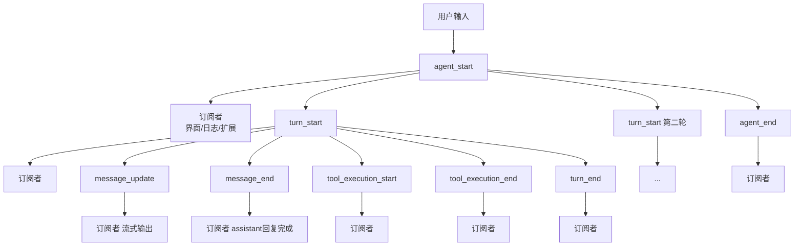

## 4. 代码实现与链路追踪

### 场景：用户输入"帮我读 config.json 并总结"

假设用户运行以下命令：

```bash
echo "帮我读 config.json 并总结" | node dist/cli.js -p "请用中文回答"
```

### 4.1 阶段一：CLI 层 — 初始化与入口

**流程图**：

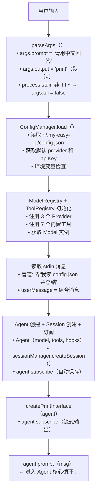

**关键代码**（`src/cli.ts` 第 203-205 行）：

```typescript
createPrintInterface(agent)
try { await agent.prompt(userMessage!); console.log('\n--- 完成 ---') }
```

**发生了什么**：
1. `createPrintInterface` 订阅了 Agent 的 `message_update` 事件，用于流式输出
2. `agent.prompt()` 被调用，传入用户消息，**真正的处理开始**

### 4.2 阶段二：Agent 层 — 消息入队与第一轮开始

**流程图**：

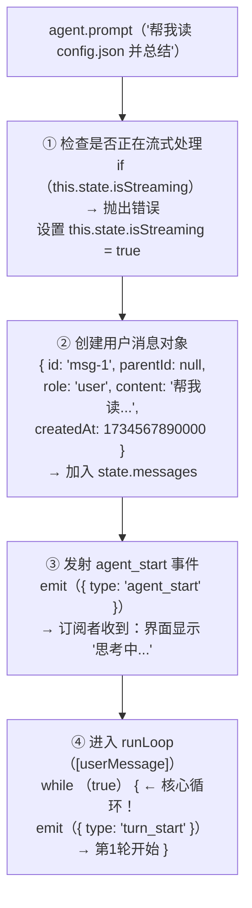

**关键代码**（`src/agent/loop.ts` 第 123-161 行）：

```typescript
async prompt(text: string): Promise<void> {
  // 防止重复调用
  if (this.state.isStreaming) {
    throw AGENT_ALREADY_STREAMING()
  }

  this.abortController = new AbortController()

  // 创建用户消息并加入消息列表
  const userMessage: AgentMessage = {
    id: generateId(),
    parentId: this.state.messages.length > 0
      ? this.state.messages[this.state.messages.length - 1].id
      : null,
    role: 'user',
    content: text,
    createdAt: Date.now(),
  }
  this.state.messages.push(userMessage)
  this.state.isStreaming = true

  try {
    await this.emit({ type: 'agent_start' })      // 通知所有订阅者
    await this.runLoop([userMessage])               // 进入核心循环
    await this.emit({ type: 'agent_end', messages: [...this.state.messages] })
  } finally {
    this.state.isStreaming = false                  // 确保流式状态被重置
    this.idleResolve?.()
  }
}
```

### 4.3 阶段三：AI 层 — 调用 LLM 获取响应

**流程图**：

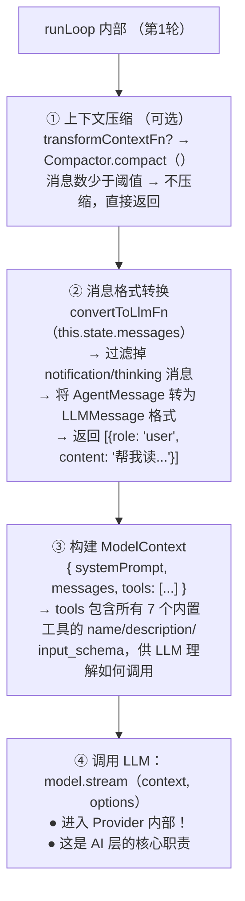

**关键代码**（`src/agent/loop.ts` 第 170-190 行）：

```typescript
// 1. 可选：对上下文进行转换/压缩
if (this.transformContextFn) {
  this.state.messages = await this.transformContextFn(this.state.messages)
}

// 2. 将 Agent 消息转为 LLM 消息格式
const llmMessages = this.convertToLlmFn(this.state.messages)

// 3. 构建 LLM 上下文（含工具定义）
const context: ModelContext = {
  systemPrompt: this.state.systemPrompt,
  messages: llmMessages,
  tools: this.state.tools.map(t => ({
    name: t.name,
    description: t.description,
    input_schema: t.parameters as Record<string, unknown>,
  })),
}

// 4. 调用 LLM 并处理流式事件
const { content, toolCalls } = await this.processLLMStream(context)
```

**消息转换函数**（`src/agent/loop.ts` 第 505-527 行）：

```typescript
function defaultConvertToLlm(messages: AgentMessage[]): LLMMessage[] {
  return messages
    .filter(m => m.role !== 'notification' && m.role !== 'thinking')  // 过滤 UI 消息
    .map(m => {
      if (m.role === 'user') {
        return { role: 'user', content: m.content }
      }
      if (m.role === 'assistant') {
        return { role: 'assistant', content: m.content, toolCalls: m.toolCalls }
      }
      // toolResult
      return { role: 'toolResult', toolCallId: m.toolCallId!, content: m.content, isError: m.isError }
    })
}
```

### 4.4 阶段四：Provider 内部 — 发送请求与解析流式事件

**流程图**（以 OpenAI Provider 为例）：

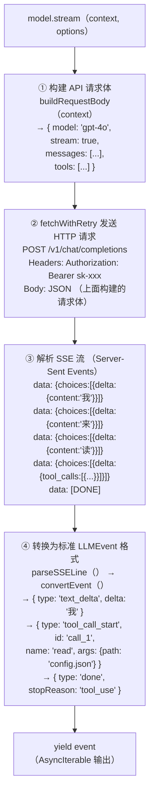

**关键代码**（`src/ai/providers/openai.ts` 第 65-115 行）：

```typescript
async *stream(context: ModelContext, options?: StreamOptions): AsyncIterable<LLMEvent> {
  const body = this.buildRequestBody(context)
  // 发送 HTTP 请求（带重试）
  const response = await fetchWithRetry(`${this.baseUrl}/v1/chat/completions`, {
    method: 'POST',
    headers: { 'Content-Type': 'application/json', 'Authorization': `Bearer ${this.apiKey}` },
    body: JSON.stringify(body),
    signal: options?.signal,
  })

  if (!response.ok) {
    yield { type: 'error', message: `OpenAI API Error (${response.status}): ${errorText}` }
    return
  }

  // 逐行读取 SSE 流
  const reader = response.body?.getReader()
  const decoder = new TextDecoder()
  let buffer = ''

  while (true) {
    const { done, value } = await reader.read()
    if (done) break
    buffer += decoder.decode(value, { stream: true })
    const lines = buffer.split('\n')
    buffer = lines.pop() || ''

    for (const line of lines) {
      const event = this.parseSSELine(line)  // 解析 SSE 为 LLMEvent
      if (event) yield event                // 逐个输出事件
    }
  }
}
```

### 4.5 阶段五：Agent 层 — 处理流式事件

**流程图**：

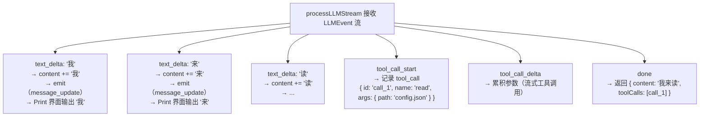

**关键代码**（`src/agent/loop.ts` 第 261-343 行）：

```typescript
private async processLLMStream(context: ModelContext): Promise<{
  content: string
  toolCalls: ToolCall[]
}> {
  let content = ''
  const toolCalls: ToolCall[] = []
  let currentToolCall: Partial<ToolCall> | null = null
  let toolCallArgs = ''

  for await (const event of this.state.model.stream(context, streamOptions)) {
    switch (event.type) {
      case 'text_delta':
        content += event.delta
        // 实时更新界面：每次有新的文本块就通知订阅者
        await this.emit({
          type: 'message_update',
          message: { content },
        })
        break

      case 'tool_call_start':
        currentToolCall = { id: event.id, name: event.name }
        toolCallArgs = ''
        // 非流式工具调用（如 Anthropic 直接提供完整 args）
        if (event.args && typeof event.args === 'object' && Object.keys(event.args).length > 0) {
          toolCalls.push({ id: event.id, name: event.name, args: event.args })
          currentToolCall = null
        }
        break

      case 'tool_call_delta':
        toolCallArgs += event.delta  // 累积流式参数
        break

      case 'done':
        // 完成未完成的流式工具调用
        if (currentToolCall && toolCallArgs) {
          try {
            const parsed = JSON.parse(toolCallArgs)
            toolCalls.push({ id: currentToolCall.id!, name: currentToolCall.name!, args: parsed })
          } catch {
            toolCalls.push({ id: currentToolCall.id!, name: currentToolCall.name!, args: toolCallArgs })
          }
          currentToolCall = null
          toolCallArgs = ''
        }
        break
    }
  }
  return { content, toolCalls }
}
```

### 4.6 阶段六：Agent 层 — 检查工具调用并执行

**流程图**：

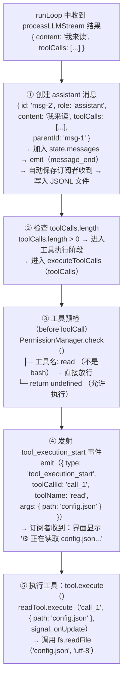

**关键代码**（`src/agent/loop.ts` 第 225-256 行）：

```typescript
// 7. 执行工具调用
const toolResults = await this.executeToolCalls(toolCalls)

await this.emit({
  type: 'turn_end',
  message: assistantMessage,
  toolResults: toolResults.map(r => ({
    content: [{ type: 'text' as const, text: r.content }],
    terminate: r.terminate,
  })),
})

// 8. 检查是否所有工具都返回 terminate: true
const allTerminate = toolResults.every(r => r.terminate)
if (allTerminate) break

// 9. 将 toolResult 加入消息列表，继续下一轮
for (let i = 0; i < toolCalls.length; i++) {
  const tc = toolCalls[i]
  const result = toolResults[i]
  this.state.messages.push({
    id: generateId(),
    parentId: assistantMessage.id,
    role: 'toolResult',
    content: result.content,
    toolCallId: tc.id,
    isError: result.isError,
    createdAt: Date.now(),
  })
}

turnMessages = []  // 继续 while(true) 进入下一轮
```

### 4.7 阶段七：工具层 — 执行 read 工具

**流程图**：

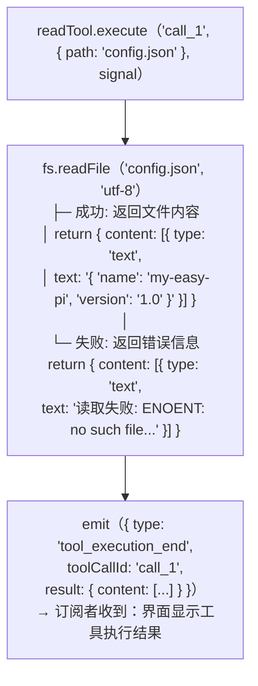

**关键代码**（`src/tools/builtin/read.ts`）：

```typescript
export const readTool: AgentTool = {
  name: 'read',
  description: '读取指定文件的完整内容',
  parameters: Type.Object({
    path: Type.String({ description: '文件路径' }),
    limit: Type.Optional(Type.Number({ description: '最大读取行数' })),
  }),

  async execute(toolCallId, params) {
    const path = params.path as string
    try {
      const content = await readFile(path, 'utf-8')    // 读取文件
      const lines = content.split('\n')
      const limit = params.limit as number | undefined
      const result = limit ? lines.slice(0, limit).join('\n') : content
      return { content: [{ type: 'text', text: result || '(空文件)' }] }
    } catch (error) {
      return {
        content: [{ type: 'text', text: `读取失败: ${error instanceof Error ? error.message : String(error)}` }],
      }
    }
  },
}
```

### 4.8 阶段八：Agent 层 — 第二轮（工具结果回传 LLM）

**流程图**：

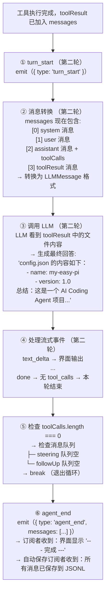

### 4.9 阶段九：接口层 — 渲染输出

**流程图**：

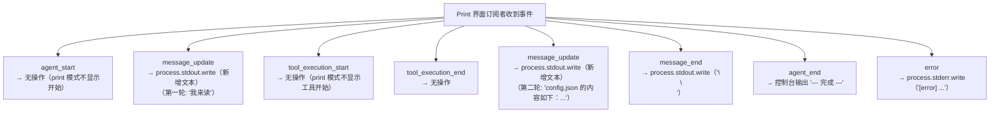

**关键代码**（`src/interface/print.ts`）：

```typescript
export function createPrintInterface(agent: Agent): void {
  let lastContentLength = 0

  agent.subscribe((event: AgentEvent) => {
    switch (event.type) {
      case 'message_update': {
        const content = event.message.content
        if (content) {
          const newPart = content.slice(lastContentLength)  // 只输出新增的文本
          if (newPart) process.stdout.write(newPart)
          lastContentLength = content.length
        }
        break
      }
      case 'message_end':
        if (event.message.role === 'assistant') {
          process.stdout.write(EOL + EOL)  // 消息结束后空行
        }
        break
      case 'error':
        process.stderr.write(`[error] ${event.message}${EOL}`)
        break
    }
  })
}
```

## 5. 完整链路时序图

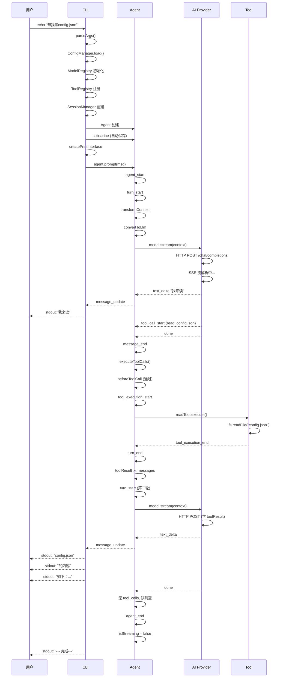

## 6. 完整的代码调用栈

当用户输入"帮我读 config.json 并总结"时，完整的调用链如下：

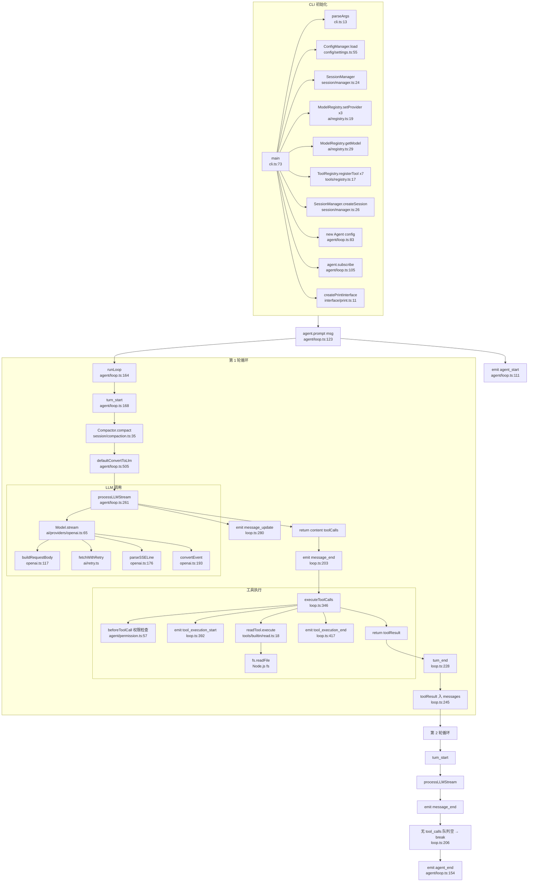

## 7. 运行与验证

### 7.1 使用 JSON 模式观察完整事件流

```bash
# 使用 JSON 输出模式，可以看到每一个事件
node dist/cli.js -m "帮我读 config.json 并总结" --output json
```

**预期输出**（JSONL 格式）：

```jsonl
{"type":"agent_start"}
{"type":"turn_start"}
{"type":"message_end","message":{"role":"user","content":"帮我读 config.json 并总结"}}
{"type":"message_update","message":{"content":"我"}}
{"type":"message_update","message":{"content":"我来"}}
{"type":"message_update","message":{"content":"我来读"}}
{"type":"message_end","message":{"role":"assistant","content":"我来读","toolCalls":[{"id":"call_1","name":"read","args":{"path":"config.json"}}]}}
{"type":"tool_execution_start","toolCallId":"call_1","toolName":"read","args":{"path":"config.json"}}
{"type":"tool_execution_end","toolCallId":"call_1","result":{"content":[{"type":"text","text":"{\n  \"name\": \"my-easy-pi\",\n  \"version\": \"1.0\"\n}"}]}}
{"type":"turn_end","message":{"role":"assistant",...},"toolResults":[...]}
{"type":"message_update","message":{"content":"config.json"}}
{"type":"message_update","message":{"content":"config.json 的内容如下："}}
{"type":"message_update","message":{"content":"config.json 的内容如下：\n\n- name: my-easy-pi\n- version: 1.0\n\n总结：..."}}
{"type":"message_end","message":{"role":"assistant","content":"config.json 的内容如下：\n\n..."}}
{"type":"turn_end","message":{...},"toolResults":[]}
{"type":"agent_end","messages":[...]}
```

### 7.2 使用 `jq` 分析事件流

```bash
# 统计事件类型
node dist/cli.js -m "你好" --output json | jq -r '.type' | sort | uniq -c

# 只看工具调用事件
node dist/cli.js -m "帮我读 config.json" --output json | jq 'select(.type == "tool_execution_start")'

# 查看消息长度变化
node dist/cli.js -m "你好" --output json | jq 'select(.type == "message_update") | .message.content | length'
```

### 7.3 使用调试模式

```bash
# 在 agent.prompt() 处设置断点，观察完整流程
node --inspect-brk dist/cli.js -m "帮我读 config.json 并总结"
```

然后在 Chrome DevTools 中打开 `chrome://inspect`，可以逐步跟踪每行代码的执行。

## 8. 小结

### 8.1 关键要点回顾

1. **一次 prompt 可能包含多轮 LLM 调用**：LLM 返回 tool_call → 执行工具 → 回传结果 → LLM 继续生成 → 最终回答
2. **事件驱动贯穿始终**：Agent 的所有输出都通过事件发射，界面层和持久化层通过订阅获取数据
3. **AI 层是性能瓶颈**：LLM API 调用是耗时最长的环节，流式机制让用户能实时看到输出
4. **工具层是"手脚"**：Agent 通过工具操作外部世界，工具结果通过消息格式回传给 LLM
5. **自动保存无侵入**：通过订阅机制实现会话持久化，Agent 核心完全不需要感知

### 8.2 各层职责速查表

| 层 | 在这一链路中的具体职责 | 关键代码 |
|------|---------------------|---------|
| **CLI 层** | 解析参数、组装模块、启动界面、调用 `agent.prompt()` | `cli.ts` |
| **Agent 层** | 管理循环、调度 LLM 调用、执行工具、发射事件 | `loop.ts` |
| **AI 层** | 构建 HTTP 请求、解析 SSE 流、标准化为 LLMEvent | `providers/openai.ts` |
| **工具层** | 执行文件操作/命令、返回结构化结果 | `builtin/read.ts` |
| **会话层** | 自动保存消息、压缩上下文 | `manager.ts`、`compaction.ts` |
| **接口层** | 渲染事件到终端、计算差异输出 | `print.ts` |

### 8.3 思考题

1. 如果 LLM 在一次响应中返回了 3 个 tool_call（read、grep、ls），Agent 会如何执行它们？执行的顺序是什么？
2. 假设某次工具执行耗时 30 秒，用户在这期间输入了新的消息（steer），Agent 会如何处理？
3. 如果 `transformContext` 函数将早期消息压缩为摘要，重新发送给 LLM 时，LLM 还能看到完整的对话历史吗？
4. 为什么 `message_update` 事件中传递的是 `{ content: "..." }`（完整内容）而不是 `{ delta: "..." }`（差异内容）？这有什么优缺点？
5. 尝试修改代码，让 Print 模式也能显示工具调用信息（类似 TUI 的 "⚙ 正在执行 read..."），应该怎么做？

> ← [上一节](./01-cli-entry.md) · [下一节](./practice.md) →
>
> [📚 返回章节首页](../09-putting-it-together/README.md)