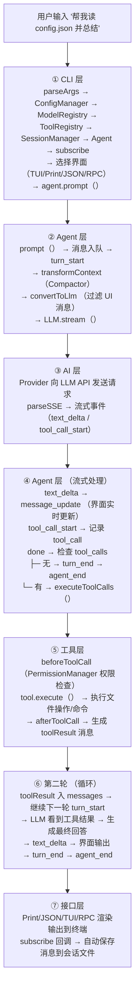

# 串联一切 — 章节概览

> 对应源码：`src/cli.ts`、`src/agent/loop.ts` 及所有模块
> 最后更新：2026-08-08
> 适用版本：my-easy-pi v0.1.0+

## 1. 本节目标

前面 8 章我们从底层到顶层逐个拆解了 my-easy-pi 的每个模块。本章的目标是**把它们重新组装起来**，从整体上理解整个系统是如何工作的：

- 理解 CLI 入口如何将各模块组装成一个完整的 Agent 应用
- 追踪一条用户消息从输入到输出的完整处理链路
- 掌握各模块之间的数据流和依赖关系
- 能够独立调试和排查 Agent 运行中的问题

## 2. 前置知识

**必须**先读完前 8 章的内容，特别是：

| 章节 | 关键内容 | 为什么重要 |
|------|----------|-----------|
| [02-ai-layer](../02-ai-layer/README.md) | Model 抽象接口、ProviderFactory、ModelRegistry | 理解 LLM 调用的核心抽象 |
| [03-agent-layer](../03-agent-layer/README.md) | Agent Loop 核心循环、状态管理、事件系统 | 理解 Agent 的运行中枢 |
| [04-tools-layer](../04-tools-layer/README.md) | ToolRegistry、7 个内置工具的实现 | 理解工具注册与执行机制 |
| [05-session-layer](../05-session-layer/README.md) | SessionManager、JSONL 存储、Compactor | 理解会话持久化 |
| [06-extension-layer](../06-extension-layer/README.md) | ExtensionAPI、扩展加载 | 理解插件化扩展 |
| [07-interface-layer](../07-interface-layer/README.md) | 4 种交互模式（TUI/Print/JSON/RPC） | 理解用户界面的多样性 |
| [08-config-and-sandbox](../08-config-and-sandbox/README.md) | ConfigManager、分层配置、沙箱 | 理解配置与安全 |

## 3. 本章结构

```
09-putting-it-together/
├── README.md               ← 本章概览（本文档）
├── 01-cli-entry.md         ← CLI 入口：组装所有模块
├── 02-end-to-end-flow.md   ← ⭐ 完整请求链路追踪
└── practice.md             ← 本章练习
```

## 4. 系统全景图

在深入细节之前，先来看一张完整的系统架构图：

```mermaid
graph TB
    subgraph CLI入口["CLI 入口 (src/cli.ts)"]
        CLIFlow["parseArgs → ConfigManager → ModelRegistry → ToolRegistry → SessionManager → Agent → subscribe → Interface"]
    end

    subgraph Agent核心["Agent 核心循环 (src/agent/loop.ts)"]
        AgentLoop["Agent Loop<br/>1. turn_start → 触发事件<br/>2. transformContext → 上下文压缩 （Compactor）<br/>3. convertToLlm → 过滤 UI 消息<br/>4. LLM.stream（） → 调用 AI 层<br/>5. 处理流式事件 → 发射 message_update<br/>6. 检查 tool_calls<br/>   ├─ 无 → 检查队列 → agent_end<br/>   └─ 有 → executeToolCalls（） → 工具执行<br/>7. 工具结果入消息队列 → 继续下一轮"]
        AgentState["Agent State: systemPrompt | model | tools | messages | isStreaming"]
        EventSys["Event System: subscribe/emit → 通知所有订阅者"]
        HookSys["Hook System: beforeToolCall / afterToolCall"]
        MsgQueue["Message Queue: steering （高优先级） / followUp （低优先级）"]
    end

    subgraph AI层["AI 层 (src/ai/)"]
        ModelReg["ModelRegistry"]
        ProviderF["ProviderFactory"]
        Providers["Anthropic / OpenAI / DeepSeek"]
        ModelStream["Model.stream（）<br/>AsyncIterable&lt;LLMEvent&gt;<br/>- text_delta<br/>- tool_call_start<br/>- tool_call_delta<br/>- done"]
        GetModel["ModelRegistry.getModel（） → 具体的 Model 实例"]
    end

    subgraph 工具层["工具层 (src/tools/)"]
        ToolReg["ToolRegistry → 7 个内置工具:<br/>read / write / edit / bash /<br/>grep / find / ls"]
        Perm["PermissionManager → beforeToolCall 钩子 → 风险控制"]
    end

    subgraph 基础设施层["基础设施层"]
        SessionMgr["SessionManager （src/session/）<br/>├─ JSONL 追加写存储<br/>├─ 会话创建/加载/删除/列<br/>└─ Compactor 上下文压缩"]
        ConfigMgr["ConfigManager （src/config/）<br/>├─ 分层配置加载 （环境变量 > 用户配置 > 项目配置）<br/>├─ API 密钥管理<br/>└─ 日志系统"]
        Ext["Extension （src/extension/）<br/>├─ ExtensionAPI: registerTool / on / 钩子<br/>└─ Loader: 动态加载 .ts 扩展文件"]
    end

    CLI入口 -->|agent.prompt("消息")| Agent核心
    Agent核心 -->|stream(context)| AI层
    AI层 -->|toolResult 消息| Agent核心
    Agent核心 -->|tool.execute()| 工具层
    工具层 -->|结果返回| Agent核心
```

## 5. 各模块依赖关系图

```
cli.ts (入口)
  ├── config/     → ConfigManager (配置加载)
  ├── ai/         → ModelRegistry, Provider (模型初始化)
  ├── tools/      → ToolRegistry, 7 个内置工具
  ├── session/    → SessionManager, Compactor (会话恢复)
  ├── agent/      → Agent, PermissionManager (核心)
  └── interface/  → Print/JSON/TUI/RPC (输出)

Agent (loop.ts)
  ├── agent/state.ts    → AgentState 状态管理
  ├── agent/queue.ts    → MessageQueue 消息队列
  ├── ai/types.ts       → 类型定义 (LLMMessage, ToolCall, 等)
  ├── tools/registry.ts → ToolRegistry 工具执行
  └── ai/registry.ts    → Model (通过 stream() 调用 LLM)
```

## 6. 核心数据流示意图



## 7. 关键设计哲学

### 7.1 分层解耦

每一层只依赖其直接下层，通过接口隔离：

```
Interface → Agent → AI Layer (Model)
                 → Tools Layer (ToolRegistry)
                 → Session Layer (SessionManager)
```

### 7.2 事件驱动

所有 UI 和扩展都通过 `subscribe/emit` 事件机制与 Agent 核心解耦：

```
Agent 核心 → emit(event) → subscribe(listener) → UI/扩展/日志
```

### 7.3 组装式架构

CLI 入口是"组装工"，负责创建所有模块实例并将它们连接起来。这种模式让测试和扩展非常容易——你可以只替换其中一个模块而不影响其他部分。

## 8. 本章文档

| 文档 | 内容 | 难度 |
|------|------|------|
| [01-cli-entry.md](./01-cli-entry.md) | CLI 入口：逐行解析 `src/cli.ts`，理解模块组装流程 | ⭐⭐⭐ |
| [02-end-to-end-flow.md](./02-end-to-end-flow.md) | 完整请求链路追踪：从用户输入到最终输出的全过程 | ⭐⭐⭐⭐⭐ |
| [practice.md](./practice.md) | 本章练习：动手实践与思考题 | ⭐⭐⭐⭐ |

> ← [📚 返回学习指南](../README.md) · [下一章](../10-advanced-topics/README.md) →
>
> → 下一篇: [01-cli-entry.md](./01-cli-entry.md)