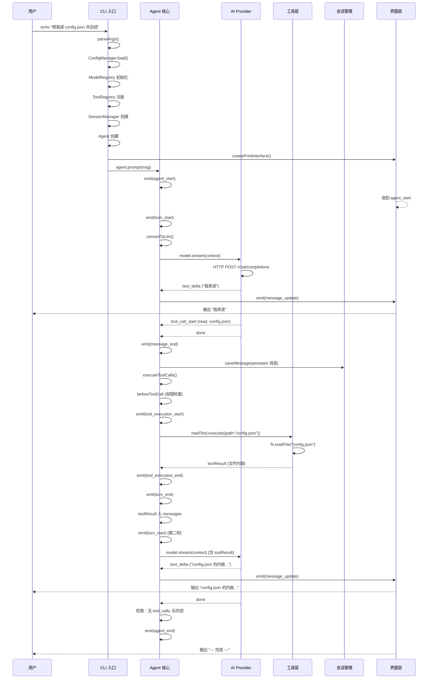

# 本章练习

> 对应源码：`src/cli.ts`、`src/agent/loop.ts` 及所有模块
> 最后更新：2026-08-08
> 适用版本：piagent v0.1.0+

## 练习说明

本章练习分为三个部分：
1. **断点追踪** — 使用调试器逐行跟踪一条消息的完整处理流程
2. **理解调用关系** — 通过分析代码理解各模块之间的依赖和协作
3. **绘制序列图** — 可视化表达系统的运行时行为

---

## 练习一：设置断点追踪一条消息的完整流程

### 目标

通过设置断点，观察一条用户消息 "帮我读 config.json 并总结" 在 piagent 各模块中的流转过程。

### 步骤

#### 1. 准备环境

```bash
# 确保项目已编译
cd /workspace
npm run build

# 创建一个测试用的 config.json
echo '{"name": "piagent", "version": "1.0.0"}' > /workspace/config.json
```

#### 2. 在关键位置设置断点

在 `src/cli.ts` 和 `src/agent/loop.ts` 中设置以下断点（建议使用 VS Code 的调试功能）：

| 文件 | 行号 | 断点条件 | 观察什么 |
|------|------|---------|---------|
| `src/cli.ts` | 74 | `main()` 入口 | 参数解析结果 |
| `src/cli.ts` | 75 | `ConfigManager` 创建 | 加载后的配置 |
| `src/cli.ts` | 128 | `ModelRegistry` 创建 | 注册的提供商 |
| `src/cli.ts` | 139 | `ToolRegistry` 注册 | 注册的工具列表 |
| `src/cli.ts` | 157 | `Agent` 构造函数 | 传入的配置 |
| `src/cli.ts` | 173 | `subscribe` 回调 | 事件类型和消息内容 |
| `src/cli.ts` | 203 | `agent.prompt()` | 用户消息内容 |
| `src/agent/loop.ts` | 123 | `prompt()` 方法 | 用户消息创建 |
| `src/agent/loop.ts` | 164 | `runLoop()` 入口 | 第一轮开始 |
| `src/agent/loop.ts` | 168 | `turn_start` | 每轮开始 |
| `src/agent/loop.ts` | 176 | `convertToLlm()` | 转换后的 LLM 消息 |
| `src/agent/loop.ts` | 190 | `processLLMStream()` | 流式事件 |
| `src/agent/loop.ts` | 206 | 检查 tool_calls | 工具调用列表 |
| `src/agent/loop.ts` | 226 | `executeToolCalls()` | 工具执行 |
| `src/agent/loop.ts` | 245 | toolResult 入消息 | 工具结果 |
| `src/agent/loop.ts` | 256 | 下一轮开始 | 循环继续 |

#### 3. 启动调试会话

```bash
# 使用 Node.js 调试模式
node --inspect-brk dist/cli.js -m "帮我读 config.json 并总结"
```

或者在 VS Code 中创建 `.vscode/launch.json`：

```json
{
  "version": "0.2.0",
  "configurations": [
    {
      "type": "node",
      "request": "launch",
      "name": "Debug piagent",
      "program": "${workspaceFolder}/dist/cli.js",
      "args": ["-m", "帮我读 config.json 并总结"],
      "sourceMaps": true
    }
  ]
}
```

#### 4. 观察记录

在调试过程中，记录以下数据：

| 阶段 | 变量 | 值 |
|------|------|----|
| 参数解析 | `args` | |
| 配置加载 | `config` 的 apiKeys | |
| 模型初始化 | `model.id`, `model.provider` | |
| 工具注册 | `toolRegistry.listTools()` 数量 | |
| 会话创建 | `sessionId` | |
| 第1轮 LLM 请求 | `llmMessages` 长度 | |
| 第1轮 LLM 响应 | `toolCalls` | |
| 工具执行 | `toolResults` | |
| 第2轮 LLM 请求 | `llmMessages` 长度 | |
| 第2轮 LLM 响应 | `toolCalls` | |
| 最终结果 | `content` | |

### 预期输出

你应该观察到类似以下的调用序列：

```
prompt() → agent_start → turn_start → convertToLlm → LLM.stream()
  → text_delta ("我来读") → message_update
  → tool_call_start (read, config.json) → done
  → message_end → executeToolCalls()
  → beforeToolCall → readTool.execute() → fs.readFile()
  → tool_execution_end → toolResult 入 messages
  → turn_end → turn_start (第二轮)
  → LLM.stream() → text_delta (最终总结) → done
  → 无 tool_calls → 队列空 → agent_end
```

---

## 练习二：理解各模块之间的调用关系

### 目标

通过分析代码，完成各模块之间的调用关系图，并回答以下问题。

### 问题 1：初始化依赖链

完成下表，说明每个模块初始化依赖哪些其他模块：

| 模块 | 依赖哪些模块 | 依赖的原因 |
|------|-------------|-----------|
| `ConfigManager` | 无（独立） | 只读取文件系统 |
| `ModelRegistry` | `ConfigManager` | 需要 API 密钥 |
| `ToolRegistry` | 无（独立） | 只注册工具定义 |
| `SessionManager` | 无（独立） | 只操作文件系统 |
| `Agent` | `ModelRegistry`, `ToolRegistry` | 需要 Model 和 Tools |
| `PermissionManager` | 无（独立） | 独立的风险规则 |
| `Compactor` | 无（独立） | 独立的消息压缩 |
| Print/JSON/TUI/RPC | `Agent` | 需要订阅 Agent 事件 |

**问题**：如果将 `PermissionManager` 的初始化移到 `Agent` 构造函数内部，会有什么好处和坏处？

### 问题 2：运行期调用链

以下是一个典型的调用链，请补充每个步骤中"谁调用了谁"：

```
步骤 1: main() 调用 agent.prompt(msg)
步骤 2: agent.prompt() → ___________ ([agent/loop.ts:___])
步骤 3: runLoop() → ___________ ([agent/loop.ts:___])
步骤 4: runLoop() → ___________ ([agent/loop.ts:___])
步骤 5: runLoop() → ___________ ([agent/loop.ts:___])
步骤 6: processLLMStream() → ___________ ([ai/providers/openai.ts:___])
步骤 7: processLLMStream() → ___________ ([agent/loop.ts:___])
步骤 8: runLoop() → ___________ ([agent/loop.ts:___])
步骤 9: executeToolCalls() → ___________ ([agent/permission.ts:___])
步骤 10: executeToolCalls() → ___________ ([tools/builtin/read.ts:___])
步骤 11: executeToolCalls() → ___________ ([agent/loop.ts:___])
步骤 12: runLoop() 回到步骤 4（下一轮）
```

### 问题 3：数据流分析

以下数据在哪些模块之间传递？请画出数据流路径：

1. **用户消息**：`"帮我读 config.json 并总结"`
   - 路径：`stdin` → `cli.ts` → `agent.prompt()` → `state.messages` → `convertToLlm()` → `ModelContext` → `Provider`
   - 经过哪些转换？

2. **工具定义**：`read` 工具的 schema
   - 路径：`read.ts` → `___________` → `___________` → `ModelContext.tools` → `Provider`
   - 经过哪些模块？

3. **工具执行结果**：`config.json` 的文件内容
   - 路径：`fs.readFile()` → `___________` → `___________` → `state.messages` → `convertToLlm()` → `ModelContext` → `Provider`
   - 经过哪些模块？

### 问题 4：事件流分析

以下是 Agent 发射的所有事件，请说明每个事件由哪个方法发射，以及哪些订阅者会处理它：

| 事件类型 | 发射方法 | 发射位置 | 订阅者处理 |
|----------|---------|---------|-----------|
| `agent_start` | `emit()` | `loop.ts:153` | 界面、扩展 |
| `turn_start` | `emit()` | `loop.ts:168` | 界面 |
| `message_update` | `emit()` | `loop.ts:280` | 界面、自动保存 |
| `message_end` | `emit()` | `loop.ts:203` | 自动保存 |
| `tool_execution_start` | `emit()` | `loop.ts:392` | 界面 |
| `tool_execution_end` | `emit()` | `loop.ts:417` | 界面 |
| `turn_end` | `emit()` | `loop.ts:228` | 自动保存 |
| `agent_end` | `emit()` | `loop.ts:154` | 界面 |

**问题**：为什么 `message_end` 事件中要判断 `event.message.role !== 'notification'` 才保存到会话？

---

## 练习三：画一张完整的系统调用序列图

### 目标

使用 Mermaid 或 PlantUML 绘制一张完整的系统调用序列图，展示 piagent 处理用户消息"帮我读 config.json 并总结"的完整过程。

### 要求

序列图应包含以下参与者（生命线）：

1. **User** — 用户（终端输入）
2. **CLI** — 命令行入口 (`src/cli.ts`)
3. **Agent** — Agent 核心 (`src/agent/loop.ts`)
4. **AI Provider** — LLM 提供商 (`src/ai/providers/`)
5. **Tool** — 内置工具 (`src/tools/builtin/`)
6. **Session** — 会话管理器 (`src/session/manager.ts`)
7. **Interface** — 界面层 (`src/interface/`)

### 参考模板

你可以使用以下 Mermaid 代码作为起点，填充完整细节：



### 完成后的检查清单

- [ ] 序列图包含所有 7 个参与者
- [ ] 展示了至少 2 轮 LLM 调用
- [ ] 展示了事件发射和订阅关系
- [ ] 展示了会话自动保存
- [ ] 展示了工具执行的全过程（预检 → 执行 → 结果回传）
- [ ] 标注了关键的数据传递（如 toolResult 回传）

---

## 进阶挑战

### 挑战 1：自定义钩子

在 `cli.ts` 中添加一个 `afterToolCall` 钩子，记录每次工具调用的耗时：

```typescript
const agent = new Agent({
  // ... 现有配置
  afterToolCall: async (ctx) => {
    console.error(`[耗时] ${ctx.toolCall.name}: ${Date.now() - startTime}ms`)
    return undefined
  },
})
```

**要求**：
- 记录每个工具从开始到结束的执行时间
- 在 `tool_execution_start` 时记录开始时间
- 在 `afterToolCall` 中计算耗时并输出到 stderr

### 挑战 2：添加事件计数器

通过 `agent.subscribe()` 添加一个事件计数器，统计一次请求中各类事件的数量：

```typescript
const counters: Record<string, number> = {}
agent.subscribe((event) => {
  counters[event.type] = (counters[event.type] || 0) + 1
})
```

**要求**：
- 在 `agent_end` 事件中输出统计结果
- 统计每种事件类型出现的次数
- 计算总耗时

### 挑战 3：多轮对话追踪

创建一个包含 3 轮以上工具调用的场景（例如：先读文件、再搜索关键词、再写结果），并追踪完整的处理流程。

**要求**：
- 使用 JSON 模式输出事件流
- 分析每轮 LLM 调用之间的消息数量变化
- 观察 `transformContext` 是否触发压缩

---

## 参考答案提示

### 练习二问题 2 的参考答案

```
步骤 2: agent.prompt() → runLoop() ([agent/loop.ts:164])
步骤 3: runLoop() → emit(turn_start) ([agent/loop.ts:168])
步骤 4: runLoop() → convertToLlm() ([agent/loop.ts:176])
步骤 5: runLoop() → processLLMStream() ([agent/loop.ts:190])
步骤 6: processLLMStream() → model.stream() ([ai/providers/openai.ts:65])
步骤 7: processLLMStream() → emit(message_update) ([agent/loop.ts:280])
步骤 8: runLoop() → executeToolCalls() ([agent/loop.ts:226])
步骤 9: executeToolCalls() → permission.check() ([agent/permission.ts:57])
步骤 10: executeToolCalls() → tool.execute() ([tools/builtin/read.ts:18])
步骤 11: executeToolCalls() → emit(tool_execution_end) ([agent/loop.ts:417])
步骤 12: runLoop() 回到步骤 4（下一轮）
```

### 验证方式

```bash
# 运行所有练习相关的测试
npm test -- --run

# 检查文档格式
npx prettier --check docs/09-putting-it-together/*.md

# 确保目录结构完整
ls -la docs/09-putting-it-together/
# 应包含：README.md, 01-cli-entry.md, 02-end-to-end-flow.md, practice.md
```