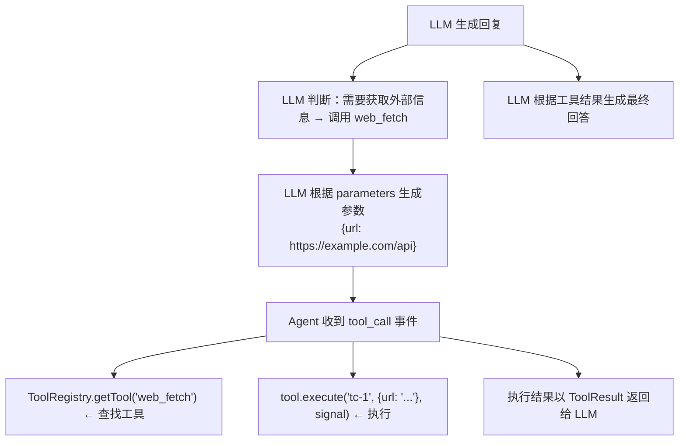
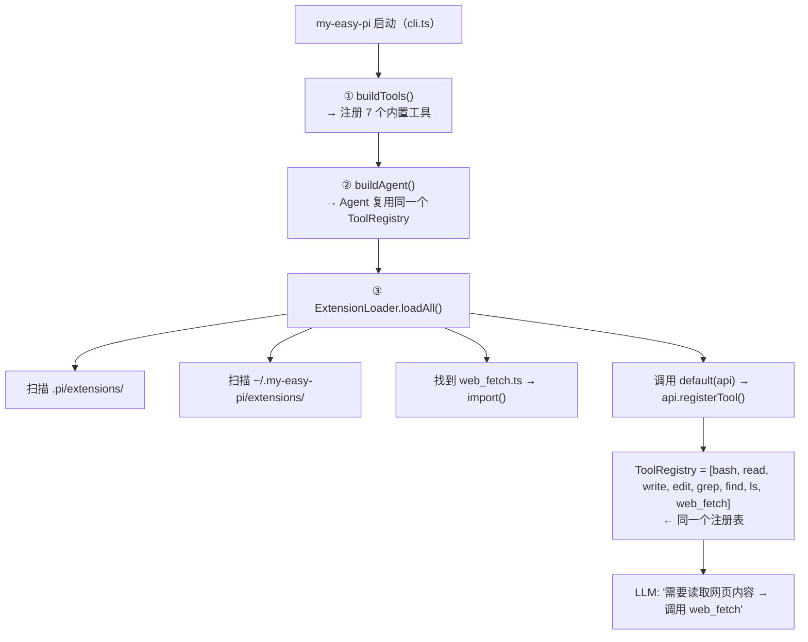

# 实践：添加一个自定义工具

## 1. 本节目标

本教程将手把手教你为 my-easy-pi 添加一个自定义工具。我们将以项目中真实实现的 **`web_fetch` 工具**（让 LLM 可以直接读取网页内容）为例，完整演示从创建文件到注册测试的全过程。

学完本节，你将能够：

- 理解 `AgentTool` 接口的设计
- 用 `TypeBox` 定义工具参数 Schema
- 通过**扩展机制**注册自定义工具（不改内核）
- 让 LLM 在对话中自动调用自定义工具

> 💡 **本教程的代码已实现在项目中**，你可以在 `examples/extensions/web_fetch.ts` 看到完整源码。我们边看代码边讲解。

---

## 2. 前置知识

- 熟悉 TypeScript 接口和类型
- 了解 `@sinclair/typebox` 的基本用法（用于定义参数 Schema）
- 了解 my-easy-pi 的工具注册机制（`ToolRegistry`）
- 建议先阅读 [工具层概览](../04-tools-layer/README.md) 和 [扩展层概览](../06-extension-layer/README.md)

---

## 3. 核心概念

### 3.1 工具的本质

在 my-easy-pi 中，一个工具就是一个实现了 `AgentTool` 接口的对象：

```typescript
// src/agent/types.ts
export interface AgentTool extends Tool {
  execute(
    toolCallId: string,
    params: Record<string, unknown>,
    signal: AbortSignal,
    onUpdate?: (update: ToolUpdate) => void
  ): Promise<ToolResult>
}
```

其中 `Tool` 接口定义了工具的"外观"（LLM 看到的部分）：

```typescript
export interface Tool {
  name: string          // 工具名（LLM 调用时的标识）
  label?: string        // 显示名（UI 展示用）
  description: string   // 描述（LLM 理解工具用途）
  parameters: JSONSchema // 参数 Schema（LLM 据此生成参数）
  executionMode?: 'parallel' | 'sequential'
}
```

**核心设计思想：** 工具接口分为两层——`Tool` 是纯数据定义（AI 层），`AgentTool` 在 `Tool` 基础上添加 `execute` 方法（Agent 层）。这样 AI 层只需要知道工具的"形状"，不需要关心执行逻辑。

### 3.2 内置工具 vs 自定义工具

这是理解本教程的关键。my-easy-pi 借鉴了 pi 的"自扩展"设计，把工具分成两类：

| | 内置工具 | 自定义工具（扩展） |
|---|---------|------------------|
| **位置** | `src/tools/builtin/` | `examples/extensions/`（示例），复制到 `.pi/extensions/`（运行时） |
| **加载方式** | 编译进内核，`cli.ts` 装配 | 运行时由 `ExtensionLoader` 自动发现 |
| **修改成本** | 需要改核心代码 | 零，加文件即可 |
| **适合** | 人人必备的基础能力 | 个人/项目专属的定制能力 |

> 这个设计正是 pi 名字的由来（self-extensible coding agent）——**Agent 能通过"扩展"来扩展自身的能力**，加一个新工具不需要碰任何核心代码。

### 3.3 工具的工作流程



### 3.4 工具描述的重要性

`description` 字段可能是整个工具定义中**最关键**的部分。LLM 通过 description 来决定是否调用这个工具、以及什么时候调用。一个好的 description 应该：

- **说清楚工具的用途**：LLM 在什么场景下应该想起这个工具
- **说明参数的作用**：帮助 LLM 正确生成参数
- **给出使用示例**：复杂的工具可以提供使用模式

---

## 4. 真实案例：web_fetch 工具

### 4.1 需求分析

在日常使用中，Agent 经常需要查阅 GitHub 上的文件、读取在线文档或调用 API。传统的做法是先用 `git clone` 或 `curl`，但这些方式要么太重量级，要么需要手动处理输出。`web_fetch` 工具的目标就是**让 Agent 可以像读本地文件一样读取网页内容**。

### 4.2 完整源码

下面是对应源码 `examples/extensions/web_fetch.ts`：

```typescript
import { Type } from '@sinclair/typebox'
import type { Operations } from '../../src/tools/operations.js'
import { defaultOperations } from '../../src/tools/operations.js'
import type { ExtensionAPI } from '../../src/extension/api.js'
import type { ToolDefinition } from '../../src/agent/types.js'

// ── 1. 工具本体：与内置工具一样，返回一个 ToolDefinition ──
export function createWebFetchTool(ops: Operations): ToolDefinition {
  return {
    // ① 工具元信息
    name: 'web_fetch',            // LLM 调用时的标识（函数名）
    label: 'Web Fetch',            // UI 显示用
    description: '读取网页内容，支持 GitHub raw 文件、API 响应、文档页面等',
    parameters: Type.Object({
      url: Type.String({ description: '要读取的网页 URL（如 https://raw.githubusercontent.com/xxx/README.md）' }),
    }),

    // ② 工具执行方法
    async execute(toolCallId, params, signal) {
      const url = params.url as string
      try {
        // 通过注入的 Operations 发起请求（可测试、可替换实现）
        const text = await ops.fetchUrl(url, signal)
        // 内容截断保护（防止返回过多 token）
        const truncated = text.length > 100_000
          ? text.slice(0, 100_000) + `\n\n...（内容已截断，共 ${text.length} 字符，仅显示前 100K）`
          : text
        return {
          content: [{ type: 'text', text: truncated }],
          details: { url, size: text.length },
        }
      } catch (error: unknown) {
        const msg = error instanceof Error ? error.message : String(error)
        // 错误处理：返回错误信息而非抛出异常
        return {
          content: [{ type: 'text', text: `请求失败: ${msg}` }],
          isError: true,
        }
      }
    },
  }
}

// ── 2. 扩展入口：默认导出一个函数，接收 ExtensionAPI ──
export default function registerWebFetchExtension(api: ExtensionAPI): void {
  api.registerTool(createWebFetchTool(defaultOperations))
}
```

### 4.3 逐行解读

#### 工具本体（`createWebFetchTool`）

- `name` 是 LLM 在生成 tool_call 时使用的标识，LLM 会说"调用 web_fetch"
- `description` 帮助 LLM 在合适的场景下选择这个工具
- **使用 factory 模式**（`createWebFetchTool(ops)`）而不是直接导出单例：工厂接受一个 `Operations`，方便测试时注入 mock，也让工具逻辑与具体实现解耦

#### 参数 Schema

```typescript
parameters: Type.Object({
  url: Type.String({ description: '要读取的网页 URL...' }),
})
```

这里使用 `@sinclair/typebox` 库来定义参数。TypeBox 是一个类型安全的 Schema 定义库：

- `Type.Object({...})` — 定义一个对象类型的参数
- `Type.String()` — 定义一个字符串字段
- 每个字段的 `description` 会被 LLM 读取，帮助它理解如何填充参数

TypeBox 会自动生成 JSON Schema：

```typescript
// TypeBox 生成的 JSON Schema
{
  type: "object",
  properties: {
    url: { type: "string", description: "要读取的网页 URL..." }
  },
  required: ["url"]
}
```

#### execute 方法

```typescript
async execute(toolCallId, params, signal) {
```

四个参数的作用：

| 参数 | 类型 | 说明 |
|------|------|------|
| `toolCallId` | `string` | 本次工具调用的唯一 ID，用于关联调用和结果 |
| `params` | `Record<string, unknown>` | LLM 生成的参数，需要手动断言类型 |
| `signal` | `AbortSignal` | 取消信号（用户按 Ctrl+C、超时等） |
| `onUpdate` | `(update) => void` | 可选，用于发送中间进度更新 |

#### 内容截断保护

```typescript
const truncated = text.length > 100_000
  ? text.slice(0, 100_000) + `...（内容已截断）`
  : text
```

**为什么需要截断？** LLM 的上下文窗口是有限的。如果返回一个包含数百万字符的文件，不仅浪费 token，还可能导致 LLM 超出上下文限制。100K 字符是一个安全阈值。

#### 为什么不抛出异常？

```typescript
} catch (error) {
  return {
    content: [{ type: 'text', text: `请求失败: ${msg}` }],
    isError: true,
  }
}
```

这是 my-easy-pi 工具设计的一个**重要原则**：
- **❌ 不要 `throw`**：异常会导致 Agent Loop 中断，LLM 看不到错误信息
- **✅ 返回 `ToolResult`**：LLM 可以读到错误信息，并决定重试或向用户解释

设置 `isError: true` 可以让 Agent 层知道这次执行失败了，但仍然把结果返回给 LLM。

### 4.4 扩展入口（注册的关键）

```typescript
export default function registerWebFetchExtension(api: ExtensionAPI): void {
  api.registerTool(createWebFetchTool(defaultOperations))
}
```

这是扩展机制的核心约定：

1. **默认导出**一个函数 —— `ExtensionLoader` 发现扩展文件后会调用 `default(api)`
2. **接收 `ExtensionAPI`** —— 通过 `api.registerTool()` 把工具注册进 `ToolRegistry`
3. **与内置工具共用一个注册表** —— 注册后 LLM 无法区分工具是内置的还是扩展的

### 4.5 注册流程示意图



---

## 5. 运行与验证

### 5.1 启用扩展

把示例扩展复制到运行时加载目录（二选一）：

```bash
# 项目级（推荐，随仓库走）
cp examples/extensions/web_fetch.ts .pi/extensions/

# 或 全局（对当前用户所有项目生效）
mkdir -p ~/.my-easy-pi/extensions
cp examples/extensions/web_fetch.ts ~/.my-easy-pi/extensions/
```

> 不用编译 —— 运行时由 `ExtensionLoader` 动态 `import()`，Node 原生支持加载 `.ts` 文件。

### 5.2 验证工具注册

```bash
# 启动后（任一模式），观察是否多出 web_fetch
npm run build
node dist/cli.js --help   # 或直接进入 TUI
```

也可以在代码里直接验证：

```bash
node -e "
import('./dist/extension/index.js').then(async ({ ExtensionLoader, ExtensionAPI }) => {
  const { ToolRegistry } = await import('./dist/tools/registry.js');
  const reg = new ToolRegistry();
  const api = new ExtensionAPI(reg);
  const loader = new ExtensionLoader(api);
  const n = await loader.loadAll();
  console.log('加载扩展数:', n);
  console.log('工具列表:', reg.listTools().map(t => t.name));
});
"
```

### 5.3 在对话中测试

启动 TUI：

```bash
npx tsx src/cli.ts
```

然后输入：

```
你能读取 https://raw.githubusercontent.com/KNeegcyao/my-easy-pi/main/README.md 的内容吗？
```

观察 Agent 是否会调用 `web_fetch` 工具来读取文件内容。

### 5.4 编写自动化测试

```typescript
// tests/unit/tools/web_fetch.test.ts
import { describe, test, expect } from 'vitest'
import { createWebFetchTool } from '../../../examples/extensions/web_fetch.js'
import { MockOperations } from '../../../src/tools/__tests__/mock-operations.js'

describe('webFetchTool', () => {
  test('工具定义正确', () => {
    const tool = createWebFetchTool(new MockOperations())
    expect(tool.name).toBe('web_fetch')
    expect(tool.description).toBeTruthy()
    expect(tool.parameters).toBeDefined()
    expect(tool.execute).toBeInstanceOf(Function)
  })

  test('参数 Schema 要求 url 字段', () => {
    const tool = createWebFetchTool(new MockOperations())
    const schema = tool.parameters as any
    expect(schema.properties?.url).toBeDefined()
    expect(schema.required).toContain('url')
  })
})
```

> 正因为工具本体用了 **factory 模式**（接收 `Operations`），测试时注入 mock 即可，不需要真实网络请求。这是"依赖注入便于测试"的典型示范。

---

## 6. 小结

### 6.1 添加自定义工具的完整流程

```
创建扩展文件 (examples/extensions/xxx.ts) → 实现 AgentTool 接口
       ↓
默认导出函数 (api) => { api.registerTool(tool) }
       ↓
复制到 .pi/extensions/ 或 ~/.my-easy-pi/extensions/
       ↓
启动 → ExtensionLoader 自动发现 → 注册到 ToolRegistry
       ↓
LLM 即可调用（无需改任何内核代码）
```

### 6.2 为什么用扩展机制（对比硬编码）

| | 硬编码进内核 | 扩展机制（本教程） |
|---|------------|------------------|
| 改动范围 | `src/` 多个文件 | 一个独立文件 |
| 升级冲突 | 内核升级可能覆盖/冲突 | 完全隔离 |
| 团队协作 | 所有人共享 | 按需启用 |
| 教学价值 | 无 | 展示"自扩展"架构思想（pi 的核心卖点） |

### 6.3 设计要点回顾

| 要点 | 说明 |
|------|------|
| **description 决定调用** | LLM 通过描述决定何时调用工具 |
| **TypeBox 定义参数** | 类型安全的 Schema 定义，自动生成 JSON Schema |
| **不抛出异常** | 返回 `ToolResult` 让 LLM 自行处理错误 |
| **内容截断** | 防止返回过多数据浪费 token |
| **依赖注入** | 工具通过 `Operations` 抽象系统调用，便于测试 |
| **扩展注册** | 默认导出函数 + `api.registerTool()`，零内核改动 |

### 6.4 延伸思考

- `web_fetch` 只支持 GET 请求。如果要支持 POST（调用 REST API），需要加哪些参数？
- 如何给 `web_fetch` 添加超时功能？（提示：`AbortSignal` + `setTimeout`）
- 当前返回纯文本。如果要支持 JSON 响应的结构化提取，应该怎么设计？

### 6.5 思考题

1. 如果要给 `web_fetch` 添加 `headers` 参数（用于设置 Authorization 请求头），参数 Schema 该如何修改？
2. 假设你发现 LLM 经常在不需要读取网页时也调用了 `web_fetch`，问题可能出在哪里？如何解决？
3. 当前的实现在内容超长时会截断。如果要让 LLM 能够分页读取完整内容，应该怎么设计？
4. 对比内置工具和扩展工具的注册方式有何不同？各自适合什么场景？
5. `ExtensionLoader` 是扫描目录、动态 `import()` 扩展文件。这种"约定优于配置"的自动发现机制，与显式配置（比如在 config.json 里列出要加载的扩展）相比，各自的优缺点是什么？

---

> ← [上一节](../10-advanced-topics/README.md) · [下一节](./02-adding-new-provider.md) →
>
> [📚 返回章节首页](../10-advanced-topics/README.md)
