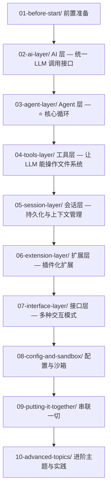

> **"What I cannot create, I do not understand."** — Richard Feynman
>
> my-easy-pi 的核心理念：**与其停留在"使用"层面，不如亲手搭建一个。**
> 这个项目源于 [Pi](https://github.com/earendil-works/pi) 的设计哲学——一个**自扩展编码 Agent**。
> my-easy-pi 是 pi 的精简学习版，保留了核心架构，砍掉了生产级复杂度，
> 让你可以在 **~3000 行核心代码**（含全屏 TUI 共 ~8600 行）的规模上，完整理解 AI Coding Agent 的每一层。

---

# 🎓 my-easy-pi 学习路线图

> 从零理解并构建一个 AI Coding Agent 的渐进式学习指南
>
> 本教程假设你已经了解 TypeScript 基础——但对 AI 和 Agent 零基础也完全 OK。

---

## 🧬 my-easy-pi 与 pi 的关系

本仓库是 [Pi](https://github.com/earendil-works/pi) 的学习伴侣。如果你熟悉 pi，你会发现：

```
Pi（生产级）                  my-easy-pi（学习版）
──────────                   ──────────
数十万行代码                   ~3000 行核心（总 ~8600 含 TUI）
多包 monorepo                 单仓库
外部文档                       10 章内嵌教程
少注释                         逐行中文注释
自扩展设计                      简化扩展系统
```

**学习路径建议：** 先通读 my-easy-pi → 再深入 pi → 最终理解 Claude Code / Cursor

---

## 🗺️ 路线图总览



---

## 📖 已完成章节

| 章节 | 说明 | 文档数 |
|------|------|--------|
| [01-before-start](01-before-start/README.md) | 前置准备 | 3 |
| [02-ai-layer](02-ai-layer/README.md) | AI 层 | 7 |
| [03-agent-layer](03-agent-layer/README.md) | Agent 层 ⭐ | 6 |
| [04-tools-layer](04-tools-layer/README.md) | 工具层 | 5 |
| [05-session-layer](05-session-layer/README.md) | 会话层 | 4 |
| [06-extension-layer](06-extension-layer/README.md) | 扩展层 | 3 |
| [07-interface-layer](07-interface-layer/README.md) | 接口层 | 5 |
| [08-config-and-sandbox](08-config-and-sandbox/README.md) | 配置与沙箱 | 4 |
| [09-putting-it-together](09-putting-it-together/README.md) | 串联一切 | 3 |
| [10-advanced-topics](10-advanced-topics/README.md) | 进阶主题 | 5 |

---

## 📐 研发流程：Spec-Driven Development（SDD）

> 本项目的标准开发流程。每个 feature 先走 OpenSpec 规格、人工 review 过关后才编码。
> 完整方案见 [openspec-sdd-plan.md](openspec-sdd-plan.md)，执行入口在仓库根 `CLAUDE.md`。

- **规格体系**：`openspec/` — 能力基线主规格（`specs/<capability>/spec.md`）+ 当前/已归档的 change（`changes/`)
- **能力审计**：[openspec-audit.md](openspec-audit.md) — 能力缺口审计报告（src/ ↔ specs/ 对照）
- **流程**：`propose → review（人工审 spec）→ apply → test → validate → archive`（delta 自动合入主规格）
- **命令**：`openspec new change / status / instructions / validate --all / archive`

已通过 SDD 沉淀的能力示例：`extension`（扩展命令调用入口，斜杠 + 首词两种触发）。

---

## 推荐阅读方式

1. **按顺序阅读** — 从 01 到 10，每章末尾的练习建议动手做
2. **边读边跑** — 每篇文档都有"运行与验证"部分，打开终端跟着做
3. **遇到不懂的往回翻** — 每章 README 有前置知识说明

---

## 参考资料

- [项目 README](../README.md) — 项目总览与快速开始
- [架构设计文档](../pi-agent-architecture.md) — 详细的分层架构设计
- [earendil-works/pi](https://github.com/earendil-works/pi) — 原版 pi 项目

---

## 🚧 计划中

暂无

---

## 💡 想贡献？

→ 见 [MAINTENANCE.md](MAINTENANCE.md)