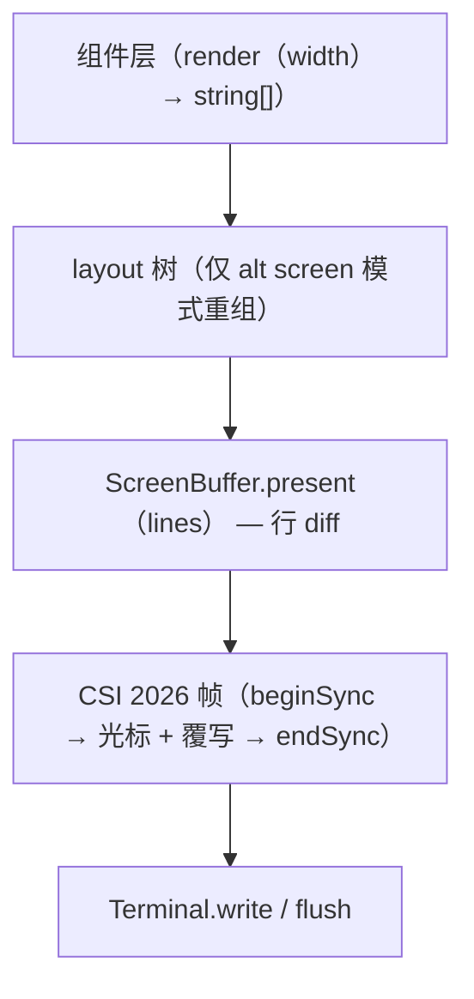

# Piagent TUI 战略 — 仿 Pi 架构的落地文档

> 状态：v1 · 2026-08-10
> 上游参考：https://github.com/earendil-works/pi
> 本文档是后续 TUI 重构的**唯一设计依据**；改动先改文档，再动代码。

---

## 0. 一句话目标

把 `src/interface/tui/` 演进成一个独立的极简终端 UI 框架（内部代号 `@my-easy-pi/tui`），实现 Pi 的五个核心策略：

1. **core/UI 彻底分层** —— `src/agent/` 不 import 任何 TUI / stdout / readline
2. **单接口双渲染器** —— `TUI` 接口下 `TuiMainScreen` / `TuiAltScreen` 可互换
3. **三方法组件契约** —— 所有 UI 元素实现 `Component`，业务组件与渲染管线解耦
4. **Differential rendering + CSI 2026 同步输出** —— 无闪烁、最低字节写入
5. **UI 是扩展点** —— 通过 `src/extension/` 注入编辑器、status line、overlay

---

## 1. 目标 / 非目标（Non-Goals 同样重要）

### 目标
- 交互式 CLI 体验对标 Claude Code 与 Pi（含 alt screen、sticky editor、滚动 transcript、overlay、键盘 + 鼠标）
- 任何输出模式（print / json / rpc / tui）都能通过 `agent.subscribe(AgentEvent)` 工作，核心零感知
- TUI 框架自身有 ≥ 80% 测试覆盖（Vitest）
- `interactive-mode.ts` 保持在 200 行以内的纯声明式组装

### 非目标（明确拒绝）
- ❌ CSS Flexbox / Grid 布局引擎（KISS；VStack/HStack/ScrollView/Dock 足够）
- ❌ 虚拟化滚动（transcript 一次性渲染行数组，靠 ScrollView 裁切即可）
- ❌ ink / blessed / React 终端框架（零依赖，自研）
- ❌ 图像协议（Kitty/iTerm2）进入 MVP；放到阶段 8 可选
- ❌ 嵌套 alternate screen（一个应用只能有一个 alt screen）
- ❌ 发布独立 npm 包（先 `src/tui/`，API 稳定后再考虑）

---

## 2. 分层架构

```mermaid
graph TB
    subgraph CLI["src/cli.ts"]
        C1["组装：选择模式、注入回调"]
    end

    subgraph Interface["src/interface/"]
        I1["print.ts （stdout 增量）"]
        I2["json.ts （JSONL）"]
        I3["rpc.ts （stdio JSON）"]
        I4["tui/ ← 本次重构对象"]
        I5["interactive-mode.ts （业务组合层）<br/>← 业务侧只用 TUI 接口"]
        I6["components/ （业务组件）<br/>transcript / statusbar 等"]
    end

    subgraph TUI["src/tui/"]
        T1["component.ts — Component/TUI 接口"]
        T2["terminal.ts — 终端能力探测 + 写入"]
        T3["screen-buffer.ts — 行缓冲 + diff"]
        T4["csi2026.ts — 同步输出（无闪烁）"]
        T5["renderer-main.ts — TuiMainScreen"]
        T6["renderer-alt.ts — TuiAltScreen"]
        T7["layout/ — VStack/HStack/ScrollView"]
        T8["components/ — Text/Markdown/Editor/..."]
    end

    subgraph Agent["src/agent/"]
        A1["loop.ts — Agent.emit → AgentEvent"]
        A2["state.ts — AgentState"]
        A3["queue.ts"]
        A4["permission.ts — 通过注入回调询问<br/>← Phase 1.1 重点"]
        A5["types.ts"]
    end

    subgraph Services["底层服务"]
        S1["src/ai/"]
        S2["src/tools/"]
        S3["src/session/"]
    end

    CLI --> Interface
    Interface --> TUI
    TUI --> Agent
    Agent --> Services
```



---

## 3. 核心契约

### 3.1 Component
```ts
export interface Component {
  render(width: number): string[]
  handleInput?(data: string): void
  wantsKeyRelease?: boolean
  invalidate(): void
}
```
- `render(width)` 返回**已含 ANSI** 的行数组；宽度之外的裁切由渲染器负责
- `invalidate()` 清空内部缓存，下一次 `render` 重新计算
- **组件不接收事件回调 props**；业务侧通过订阅 `AgentEvent` + 调 `component.invalidate()` + `tui.requestRender()` 驱动

### 3.2 Focusable（类型守卫，不用继承）
```ts
export interface Focusable {
  readonly hasFocus: boolean
  focus(): void
  blur(): void
}
export function isFocusable(c: Component): c is Component & Focusable { /* impl */ }
```

### 3.3 TUI（渲染器接口）
```ts
export interface TUI {
  registerComponent(c: Component): void
  unregisterComponent(c: Component): void
  requestRender(): void

  // dock 把组件钉在边缘（main screen 忽略）
  dock(position: 'top' | 'bottom', c: Component): void

  setMain(c: Component): void

  showOverlay(c: Component, opts?: OverlayOptions): OverlayHandle
  closeOverlay(h: OverlayHandle): void

  start(): void
  stop(): void   // alt screen: 退出时把 transcript 回放到主屏
}
```

两种实现：
- **`TuiMainScreen`**：保留终端原生 scrollback；transcript 完成后永久打印并滚动；只对尾部 editor/loader 做帧内 diff
- **`TuiAltScreen`**：`\x1b[?1049h` 进 alt buffer；应用自管 viewport 与滚动；布局引擎参与；退出时把 transcript 完整回放到主屏供 grep / tmux copy

---

## 4. 渲染管线



关键约束：
- **任何 stdout 写入必须经 `Terminal`**，业务侧 `process.stdout.write` 视为 bug
- Markdown 等高成本渲染必须有行缓存；`invalidate()` 是唯一清缓存途径
- resize 触发：全树 invalidate → requestRender

---

## 5. 关键决策

| # | 决策 | 理由 |
|---|---|---|
| 1 | 先 `src/tui/`，不抽 `packages/tui` | API 未稳定，避免双仓摩擦 |
| 2 | 沿用现有 `markdown-renderer.renderToLines()` 包一层 | 已经 target 一致（行列），零风险 |
| 3 | Permission 走**回调注入**，不发事件 | 事件是 fire-and-forget，确认需要 Promise |
| 4 | CSI 2026 失败自动降级到顺序写入 | tmux 旧版不支持，不能 hard fail |
| 5 | 鼠标协议 SGR 1006 在阶段 6 才启用 | 编辑器键盘优先 |
| 6 | 四种输出模式继续并存，不动 print/json/rpc | 保持非交互路径稳定 |
| 7 | `/cost` 命令在拿到真实 usage 前显示 `N/A` | 不展示伪数据 |

---

## 6. 阶段划分与验收

| 阶段 | 主要产出 | 验收 |
|---|---|---|
| **0. 架构冻结** | 本文档 | 文档评审通过 |
| **1. 解耦补漏** | permission.ts 走回调；伪 token 处理 | `grep` 结果干净，测试通过 |
| **2. Terminal/Buffer** | terminal.ts + screen-buffer.ts + csi2026.ts | diff 单测 ≥20 例；demo 无闪烁 |
| **3. 骨架组件** | component.ts + Text/Markdown/Editor/Loader/Box | 组件单测 + markdown 缓存基准 |
| **4. TuiMainScreen** | 接管现有 transcript | 体验等价于现状，可回滚 |
| **5. TuiAltScreen** | Alt screen + layout 引擎 | resize 不撕裂；长会话流畅 |
| **6. 交互** | 键盘/鼠标/焦点/overlay | 全键盘可用，鼠标滚动可用 |
| **7. 业务组合层** | interactive-mode.ts ≤200 行 | grep 命中 escape 仅在 src/tui/ |
| **8. 扩展与打磨** | extension API + themes + 测试/文档 | 覆盖率 ≥80%，文档更新 |

估算：MVP（到阶段 5）4-6 个有效工作日；完整 8 阶段 8-12 天。

---

## 7. 与现有代码的对应关系

| 现有文件 | 新位置 | 迁移方式 |
|---|---|---|
| `interface/tui/theme.ts` ANSI helpers | `src/tui/ansi.ts` | 抽出共用，颜色语义化 |
| `interface/tui/editor.ts` readline 循环 | `src/tui/components/editor.ts`（raw mode） | 重写 |
| `interface/tui/renderer.ts` 流式 markdown | `src/tui/components/transcript.ts` + `markdown.ts` | 包装现有 renderToLines |
| `interface/tui/commands.ts` slash 命令 | `interface/tui/commands.ts`（保留） | 改为操作 state，不直接写 stdout |
| `interface/tui/index.ts` alt screen 管理 | `src/tui/renderer-alt.ts` + `terminal.ts` | 重写 |
| `interface/markdown-renderer.ts` | `src/tui/components/markdown.ts`（包装） | 复用 |
| `agent/permission.ts` | 同位置重写 | 阶段 1.1 |

---

## 8. 何时修改本文档

任何下列变化先改本文档、再动代码：
- 增删阶段
- 改动 Component / TUI / Focusable 接口
- 引入新依赖（期望长期保持 zero runtime dependency）
- 改变渲染管线流向（组件→layout→buffer→csi2026→write）
